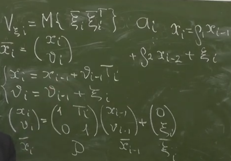
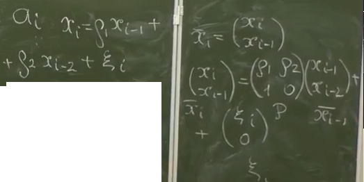

# Заметки

## Марковские процессы и АР функции

При фильтрации мы пользуемся Марковскими процессами, которые зависят только от своего предыдущего значения. Используются уравнения авторегрессии первого порядка

$$
    x_i = \rho x_{i-1} + \xi_i
$$

Через векторную форму можно представить и авторегерссионную модель второго прядка

$$
    x_i = \rho_1 x_{i-1} + \rho_2 x_{i-2} + \xi_i
$$

В следящем измерителе фильтрация выполняет линейный фильтр, который является и экстраполятором. Он может быть выполнен в качестве фильтра Калмана. Экстраполятор выполняет оценку параметров во времени
