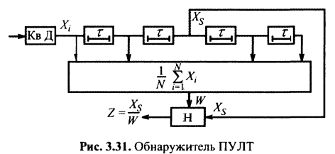

# 1 Исследование особенностей построения и ТТХ наземных РЛС и РНС

## 1.1 Типовые сигналы в радиолокации и радионавигации

- Импульсные/Непрерывные
- Узкополосные/широкополосные
- Простые/сложные
- Модуляция
  - Частотная (ЛЧМ, НЛЧМ)
  - Фазовая (М-последовательность, коды Баркера)
  - Импульс, пачка импульсов

---

## 1.2 Факторы, определяющие отражательную и излучающую способность объектов активной и пассивной радиолокации

Факторы:
1. Материал цели
2. Геометрия цели
3. Взаимное расположение передатчика, приемника и цели
4. Частота/длина волны и размеры цели
5. Поляризация волны

Совокупность факторов описывается параметром эффективная поверхность рассеяния (ЭПР).

$$
    \sigma = \lim_{R \to \infty}4\pi R^2 \frac{P_{отр}}{P_{пад}}
$$

Измеряется либо в квадратных метрах, либо нормируется к дБ. ЭПР может зависеть от угла и поляризации. ЭПР не учитывает фазовые соотношения при отражении.

Под ЭПР понимают площадь поперечного сечения такого гипотетического идеального изотропного (рассеивающего энергию во всех направлениях равномерно) отражателя (например, шара), который будучи помещен на место цели создает на входе приемной антенны РЛС такую же плотность потока мощности, что и сама цель.

---

## 1.3 Электродинамические эффекты, влияющие на характер вторичного излучения

Соотношение размеров цели и длины волны.

Пример облучения сферы радиусом $r$

1. Зона дифракции (зона Релея) $r/\lambda \ll 1$. $P_{рас}/P_0$ невелико и монотонно изменяется.
2. Зона резонансного рассеяния $r \approxeq \lambda$. $P_{рас}/P_0$ может принимать различные значения (т.е. сильно зависит от $r/\lambda$)
3. Зона отражения $r/\lambda \gg 1$. $P_{рас}/P_0 = \text{const}$

---

## 1.4 Влияние условий распространения радиоволн на характеристики сигналов

### 1. Дисперсия среды

Отличие фазовой скорости в реальной среде $v_ф$ от соответствующей скорости в свободном пространстве.

Фазовая скорость - скорость перемещения геометрического места точек с постоянной фазой (волнового фронта) при распространении монохроматической волны.

В недиспергирующей среде скорость распространения модуляции (групповая скорость) равна фазовой скорости каждой составляющей.

Дисперсия может зависеть от частоты, соответственно будет влиять на ФЧХ характеристику.

### 2. Рефракция радиоволн

Искривление направления распространения радиоволн. Возникает в неоднородной среде с изменяющимся от точки к точке коэффициентом преломления $n_r = \sqrt{\varepsilon}$.

Приводит к ошибкам определения угловых координат цели. Однако позволяет осуществлять загоризонтную радиолокацию.

### 3. Отражение от ионосферы

### 4. Поглощение в атмосфере (для некоторых диапазонов частот)

---

## 1.5 Модели временных, пространственно-временных и поляризованных сигналов передаваемых сообщений и помех в задачах обнаружения, измерения, фильтрации и разрешения

### Детерминированный сигнал
Сигнал с полностью известными параметрами

$$
    u(t) = U_m(t)\cos(2\pi f_0t + \varphi(t) + \varphi_0)
$$

### Квазидетерминированный сигнал
Сигнал со случайными параметрами

$$
    y(t) = \theta U_m(t, \mu) + n(t)
$$

где $\mu$ - вектор случайных величин параметров сигнала

Два основных случая:
1. Сигнал со случайной начальной фазой $u(t) = U_m(t)\cos(2\pi ft + \varphi(t) + \varphi)$, где $\varphi$ случайная начальная фаза распределенная от -$\pi$ до $\pi$.
2. Сигнал со случайной фазой и флуктуирующей амплитудой $u(t) = U_m(t)\cos(2\pi ft + \varphi(t) + \varphi)$, где амплитуда распределена по закону Релея

Могут быть также пачки когерентных и некогерентных импульсов. У когерентных начальные фазы коррелированны, у некогерентных нет.

---

## 1.6 Модели сигналов теплового излучения

Энергия, излучаемая телом будет определятся формулой Планка, в которую переходит закон Релея-Джинса.

$$
    J_f = \frac{2\varepsilon h f^3}{c}\frac{1}{\exp(hf/kT_T^\circ) - 1}
$$

где $h$ - постоянная Планка, $k$ - постоянная Больцмана, $f$ - частота, Гц, $\varepsilon$ - степень черноты тела или излучательная способности.

Чем больше температура, тем больше мощность  излучения.

При одинаковой температуре из излучения различаются из-за разной излучательной способности $\varepsilon$ и обнаружение объектов возможно по контрасту яркостных температур $\Delta T^\circ = T_1^\circ - T_2^\circ = (\varepsilon_1 - \varepsilon_2)T_T^\circ$.

Радиотепловой сигнал, принятый антенной, представляет собой шум с дисперсией $\sigma_c^2$. Сигнал и шум будут $n$-мерными гауссовскими распределениями вероятностей, отличающимися только дисперсиями.

$$
    W_п(n) = \left(\frac{1}{\sqrt{2\pi\sigma_п^2}}\right)^n\exp\left(-\frac{\sum_i^nu_i^2}{2\sigma_п^2}\right)^2
    \\
    W_{сп}(n) = \left(\frac{1}{\sqrt{2\pi(\sigma_п^2 + \sigma_с^2)}}\right)^n\exp\left(-\frac{\sum_i^nu_i^2}{2(\sigma_п^2 + \sigma_c^2)}\right)^2
$$

Решение о наличии сигнала можно принять, сравнивая пороговое значение с накопленной мощностью

$$
    Y = K\intop_0^{Т_н}u^2(t)dt \gtrless U_{пор}
$$

Оптимальный обнаружитель будет состоять из квадратичного детектора, сумматора и порогового устройства.

---

## 1.7 Модели движения объектов в задачах навигации

$$
    X_{k+1} = F_k X_k
    \\
    Z_{k} = H_k X_k + w_k
$$

### 1.7.1 Модель с постоянной скоростью

$$
    \begin{bmatrix} x_{k+1} \\ v_{k+1} \end{bmatrix} =
    \begin{bmatrix} 1 & \delta t \\ 0 & 1 \end{bmatrix}
    \begin{bmatrix} x_{k} \\ v_{k} \end{bmatrix} \\
    Z_k = \begin{bmatrix} 1 & 0 \end{bmatrix} \begin{bmatrix} x_{k} \\ v_{k} \end{bmatrix}
    + w_k
$$

### 1.7.2 Модель с постоянным ускорением

$$
    \begin{bmatrix} x_{k+1} \\ v_{k+1} \\ a_{k+1} \end{bmatrix} =
    \begin{bmatrix} 1 & \delta t & \delta t^2/2\\ 0 & 1  & \delta t \\ 0 & 0 & 1\end{bmatrix}
    \begin{bmatrix} x_{k} \\ v_{k} \\ a_{k} \end{bmatrix} \\
    Z_k = \begin{bmatrix} 1 & 0 & 0\end{bmatrix} \begin{bmatrix} x_{k} \\ v_{k} \\ a_{k}\end{bmatrix}
    + w_k
$$

### 1.7.3 Модель с постоянной угловой скоростью

### 1.7.4 Модель с неизвестной постоянной угловой скоростью

---

## 1.8 Показатели качества обнаружения, измерения, разрешения и фильтрации

1. Обнаружение - вероятность правильного обнаружения, вероятность ложной тревоги, характеристика обнаружения
2. Измерение (оценка) - дисперсия (эффективность) оценки, несмещенность, состоятельность.
3. Разрешение - вероятность ошибки, т.е. вероятность перепутать 2 сигнала.
4. Флуктуационная, динамическая ошибка, сумма дисперсий флуктуационной и динамической ошибки

---

## 1.9 Решение задачи оптимизации обнаружения, измерения и фильтрации

### 1.9.1 Обнаружение

Строится отношение правдоподобия и сравнивается с порогом.

### 1.9.2 Измерение (оценка)

По максимуму функции правдоподобия. Берется производная от функции правдоподобия и приравнивается к 0.

Оптимальный неследящий измеритель содержит схему формирования функции правдоподобия (или её логарифма, или отношения правдоподобия) и выбор максимума.

### 1.9.3 Фильтрация

Оптимальный следящий измеритель состоит из схемы, формирующей отношение правдоподобия, дискриминатора и линейного инерционного фильтра, управляющего сигналом ошибки.

Входное напряжения является сложной нелинейной функцией оцениваемого параметра, поэтому обычно задачу линеаризуют. Для этого формируют функцию малых отклонений $\Theta' = \Theta - \Theta_0$ с помощью дискриминатора.

Линейный фильтр, формирующий сигнал ошибки - экстраполятор (фильтр Калмана и альфа-бета фильтр)

---

## 1.10 Использование критерия отношения правдоподобия для нахождения оптимальных алгоритмов обнаружения, измерения и фильтрации параметров временных, пространственно-временных и поляризованных сигналов на фоне различных помех

### 1.10.1 Обнаружение

См. выше. Из отношения правдоподобия получается решающее правило через интеграл вероятности, реализуемое через коррелятор или согласованный фильтр.

### 1.10.2 Измерение (оценка)

См. выше. Берется производная по отношению правдоподобия и приравнивается к 0. Тем самым ищется максимум.

---

## 1.11 Особенности обнаружения, измерения и фильтрации при неизвестных параметрах сигнала и помех

При известном законе распределения сигнала и помехи могут быть неизвестны параметры этого распределения (параметрическая неопределенность). В таком случае не удается восстановить связь входной реализации с условным риском. Адаптация - процесс восстановления соответствия между ожидаемыми потерями и этой информацией.

Основные методы преодоления априорной неопределенности:
- Адаптация к неизвестным параметрам сигнала или помехи
- Создание устройств, не чувствительных к виду помех (инвариантных)
- Создание робастных систем (чьи параметры не сильно ухудшаются при изменении параметров распределения)

Неизвестными параметрами помехи могут являться:
- Мощность помехи $\sigma_п^2$
- Доплеровская поправка частоты $\omega_д$ или набег фазы $\omega_дT_и$ для пассивной помехи
- Ширина полосы помехи
- Коррелированность помехи

Для учета изменения мощности помехи $\sigma_п^2$ применяют обнаружитель с изменением порога обнаружения в соответствии с интенсивностью помех в элементах разрешения (ПУЛТ - постоянный уровень ложных тревог).

Незнание закона распределения решается через применение инвариантных или адаптивных обнаружителей

Инвариантные обнаружители позволяют при воздействии стационарной помехи и выборки конечной мерности перейти к новой статистике, не зависящей от выборочных значений.

Примерами такого обнаружителя может быть
- Знаковый обнаружитель

Ш огр - широкополосный ограничитель

- Ранговый обнаружитель
- Статистика ступенек

Обнаружители, сохраняющие в некоторых пределах свои характеристики при изменении свойств помехи называются робастными. Известен робастный обнаружитель Неймана-Пирсона с ограничителем.

---

## 1.12 Принципы адаптивной обработки сигналов

См. вопрос 1.11
