# 2 Исследование особенностей построения и ТТХ бортовых  РЛС и РНС

## 2.1 Обнаружение когерентных сигналов с известными и случайными параметрами

Некогерентные сигналы - сигналы, фазовую структуру которых нельзя считать закономерной.

Через отношение правдоподобия получаем корреляционный интеграл. Их вычисление с помощью коррелятора или фильтра.

---

## 2.2 Корреляционные, корреляционно-фильтровые и фильтровые обнаружители когерентных сигналов

Корреляционная/фильтровая для полностью известного сигнала

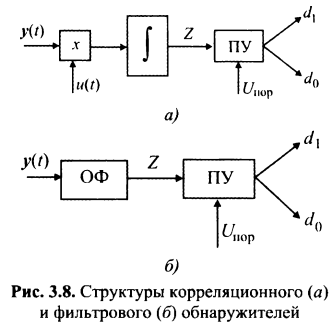

Корреляционная фильтровая для сигнала с неизвестной начальной фазой

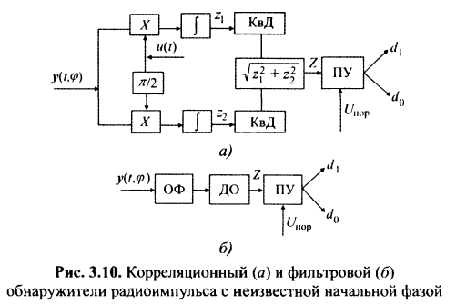

При комбинированном способе используется как перемножение напряжений, так и фильтрация полученного колебания.

Для пачки когерентных радиоимпульсов, её представляют как произведение $x(t, \alpha) = x_1(t, \alpha) \cdot x_2(t, \alpha)$периодической последовательности видеоимпульсов $x_1(t, \alpha)$ и высокочастотного колебания $x_2(t, \alpha)$

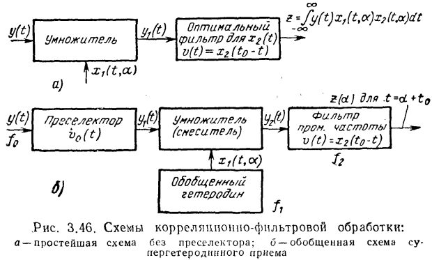

Входная последовательность сначала умножается на последовательность видеоимпульсов, а потом фильтруется Сф, согласованным с высокочастотным колебанием.

Умножитель (схема *б*) может также выполнять функцию смесителя (перенос на ПЧ)

---

## 2.3 Особенности построения обнаружителей когерентных сигналов на фоне помех со случайной интенсивностью и негауссовых помех

Когда мощность помехи изменяется применяется обнаружитель с постоянным уровнем ложных тревог

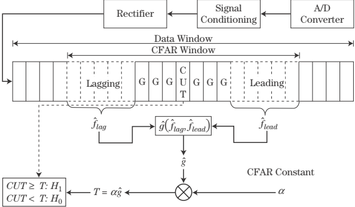

$$
    T = \alpha\hat{g}
$$

где $\hat{g}$ - статистика, связанная с помехой, $\alpha$ - параметр, связанный с желаемым уровнем ложных тревог

Как пример такой реализации

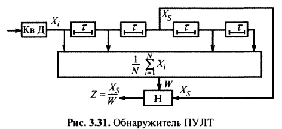

Когда ПВ помехи неизвестна или подвержена изменениям в процессе работы, применяются робастные или инвариантные алгоритмы. В качестве таковых возможен переход к знаковой статистике, ранговой статистике, ограничивающая статистика и т.д.

В ранговой статистике принятые значения ранжируются, а затем статистика определяется по k-ому значению.

Ограничивающая статистика отбрасывает верхние (по уровню) N значений из выборки.

---

## 2.4 Обнаружение некогерентных, в том числе шумовых, сигналов

Некогерентные сигналы - сигналы, фазовую структуру которых нельзя считать закономерной. Пример - пачка радиоимпульсов, начальные фазы которых неизвестны.

Для некогерентных сигналов мы переходим от статистики с корреляционным интегралом, к статистике с модифицированной функцией Бесселя через усреднение по начальной фазе.

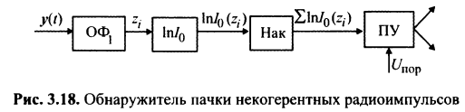

Для сравнения вид когерентного накопления пачки импульсов

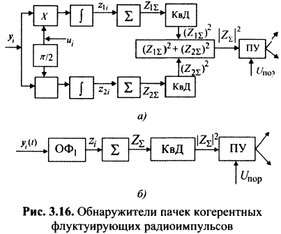

Логарифм модифицированной функции Бесселя хорошо аппроксимируется либо линейным, либо квадратичным детектором, в зависимости от значения аргумента.

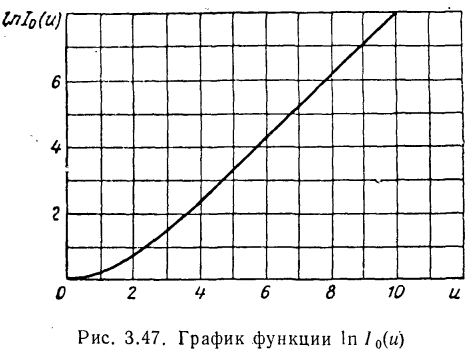

Шумовые сигналы в вопросе 2.7

---

## 2.5 Показатели качества обнаружения когерентных и некогерентных сигналов

Для полностью известного сигнала

$$
    D = 1 - Ф\left(\frac{z_0}{\sqrt{N_0E}} - \sqrt{\frac{E}{N_0}}\right)
    \\
    F = 1 - Ф\left(\frac{z_0}{\sqrt{N_0E}}\right)
$$

Для неизвестной начальной фазы

$$
    D = Q_1\left(\frac{E}{\sqrt{N_0E}}, \frac{z_0}{\sqrt{N_0E}}\right)
    \\
    F = \exp\left(-\frac{1}{2}\frac{z_0^2}{N_0E}\right)
$$

Для флюктуирующей амплитуды, распределенное по закону Релея.

$$
    D = \exp\left( -\frac{1}{2}\frac{z_0^2}{E_cN_0}\frac{1}{\left(1 + \overline{E}_c/N_0\right)} \right)
    \\
    F = \exp\left(-\frac{1}{2}\frac{z_0^2}{N_0E}\right)
$$

где средняя энергия $\overline{E}_c = E_c\overline{U}_0^2$, а $\overline{U}_0 = \sqrt{2}\sigma_U$.

Для некогерентных сигналов будет выигрыш от некогерентного суммирования импульсов. Каждые отдельный импульс будет распределен по закону Релея-Райса или экспоненциальному (в зависимости от вида детектора), можно получить распределение их суммы. При некогерентном наблюдаются потери в пороговом значении импульса, которое необходимо для обнаружения сигнала.

---

## 2.6 Обнаружение когерентных и некогерентных пространственно-временных и поляризованных сигналов

Алгоритм разделяется на пространственную и временную обработку, и выполняется пространственными и временными фильтрами. Сначала выполняется пространственная обработка по пространственным частотам.

Возможно вычисление пространственного корреляционного интеграла

$$
    Y = \intop_G\intop_G\intop_0^T\dot{z}(x, y, t) \cdot \dot{s}^*(x, y, t, \lambda)dx dy dt
$$

Где

---

## 2.7 Особенности обнаружения шумовых сигналов применительно к задачам пассивной локации источников их излучения

Статистика помехи и сигнала-помехи будут обу шумовые, различие будет только в мощности шума.

Радиотепловой сигнал, принятый антенное, представляет собой шум с дисперсией $\sigma_c^2$. Сигнал и шум будут $n$-мерными гауссовскими распределениями вероятностей, отличающимися только дисперсиями.

$$
    W_п(n) = \left(\frac{1}{\sqrt{2\pi\sigma_п^2}}\right)^n\exp\left(-\frac{\sum_i^nu_i^2}{2\sigma_п^2}\right)^2
    \\
    W_{сп}(n) = \left(\frac{1}{\sqrt{2\pi(\sigma_п^2 + \sigma_с^2)}}\right)^n\exp\left(-\frac{\sum_i^nu_i^2}{2(\sigma_п^2 + \sigma_c^2)}\right)^2
$$

Переходя к отношению правдоподобия, решение о наличии сигнала можно принять, сравнивая пороговое значение с накопленной мощностью

$$
    Y = K\intop_0^{Т_н}u^2(t)dt \gtrless U_{пор}
$$

Оптимальный обнаружитель будет состоять из квадратичного детектора, сумматора и порогового устройства.

---

## 2.8 Автокорреляционные функции, тела и диаграммы неопределенности основных видов когерентных временных, пространственно-временных и поляризованных сигналов

Диаграмма неопределенности - плоскость, параллельная плоскости $O\tau\nu$ на заданном уровне

Для простого импульса длительностью $T$ (от $-T/2$ до $T/2$) и амплитудой $1/\sqrt{T}$

$$
    |\chi(\tau, \nu)| = \left|\left(1 - \frac{|\tau|}{T}\right)\frac{\sin(\pi\tau\nu(1 - |\tau|/T))}{\pi\tau\nu(1 - |\tau|/T)}\right|
$$

Треугольник в разрезе по нулевому Доплеру, sinc в разрезе по нулевой дальности.

Для импульса с ЛЧМ заполнением, ДН представляет из себя тот же эллипс, повернутый на угол $\alpha = \arctg\Delta f/\tau_и$

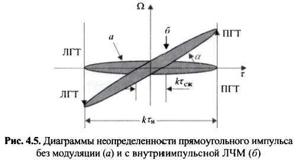

Для когерентной пачки простых импульсов. В разрезе корреляции просто вычисляем АКФ. В разрезе нулевой дальности преобразование Фурье можно получить, сначала свернув во временной области с бесконечной последовательностью $\delta$-функций, а затем умножив на прямоугольную огибающую.

---

## 2.9 Примеры построения различного типа обнаружителей (корреляционных, корреляционно-фильтровых и фильтровых) узкополосных сигналов, как одиночных, так и пачечных, линейно-частотно-модулированных сигналов, фазоманипулированных сигналов при использовании линейных рекуррентных последовательностей: кодов Баркера, многофазовых кодов, М-кодов и др

Для одиночных сигналов представлен в вопросе 2.2.

Для пачки сигналов (когерентных и некогерентных) структуры обнаружителей представлены в вопросе 2.4.

Для ЛЧМ и ФМ сигналов используется фильтр, согласованный с соответствующим сигналом. Для ФМ сигнала можно использовать линию задержки и сумматор.

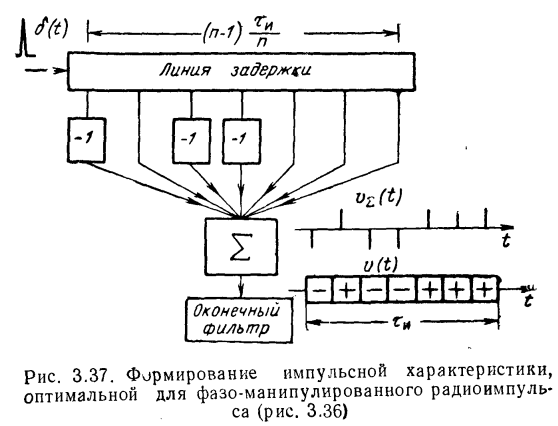

Для ЛЧМ сигнала помимо фильтра, обнаружитель может иметь следующий вид

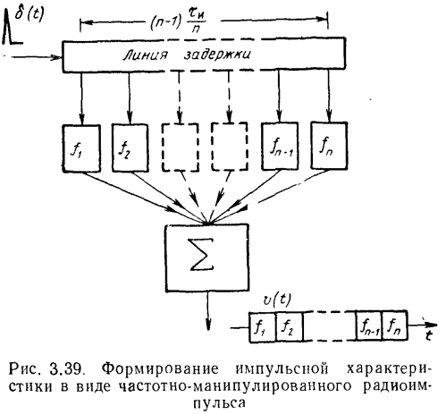

---

## 2.10 Методика сжатия радиоимпульсов

Сжатие импульсов позволяет повысить разрешающую способность по дальности при той же длине импульса. Импульс сжимается пропусканием его через согласованный с ним фильтр.

Выигрыш от сложного сигнала будет определятся выигрышем в ОСШ по сравнению с простым сигналом с той же разрешающей способностью по дальности.

$$
    B \cdot T_{\text{wb}} = 100 \text{, } \delta T = \frac{1}{B}
$$

Тогда длительность простого импульса с той же разрешающей способностью должна быть

$$
    T_{\text{nb}} = \frac{1}{B}
    \\
    \frac{T_{\text{wb}}}{T_{\text{nb}}} = 100
$$

При той же энергии ОСШ будет в 100 раз больше у сложного сигнала, при этом у него будет та же разрешающая способность.

Для ЛЧМ импульса ширина основного лепестка (при достаточно большой базе) будет определятся шириной спектра.

Для ФМ импульса ширина спектра будут определятся частотой сменой кодов, а разрешающая способность будет определятся длиной одного чипа.

---

## 2.11 Фильтры сжатия

Оптимальный и подоптимальные.

Оптимальные дают максимальное ОСШ в момент принятия решения

$$
    SNR(t_0) = \frac{E_s}{\intop_{-\infty}^\infty N(f)|K(f)|^2df}
$$

Для случая белого гауссова шума (эквивалентны?)

$$
    SNR(t_0) = \frac{2E_c}{N_0}
    \\
    SNR(t_0) = \frac{E_c}{\sigma_n^2}
$$

Для уменьшения уровня боковых лепестков применяются подоптимальные фильтры, при этом проводится оптимизация по следующим параметрам:

- Уровень УБЛ
- Ширина основного лепестка
- Энергетические потери (уровень основного лепестка в момент принятия решения)
- Чувствительность к доплеровским сдвигам частоты
- Скорость спада боковых лепестков

Можно сначала пропустить сигнал через согласованный фильтр, а затем через подоптимальный фильтр (например R-G (Rihaczek-Golden) фильтр), либо сразу применять подоптимальный фильтр (который синтезируется с помощью метода минимизации среднеквадратичной ошибки, либо через метод линейного программирования).

Для уменьшения УБЛ может применятся весовая функция, которая уменьшает УБЛ за счет более гладкого вида спектра по краям.

Для ФМ сигнала УБЛ можно уменьшить за счет более "плавных" переходов между скачками фазы.

---

## 2.12 Цифровые обнаружители когерентных и некогерентных сигналов с обработкой во временной и частотной области

На промежуточной частоте сигнал оцифровывается с помощью АЦП. После обычно сигнал переносится на нулевую частоту при помощи цифрового фазового детектора (ЦФД), который осуществляет квадратурную демодуляцию.

Затем возможно применяется весовое окно. После либо вычисляется корреляция, либо в частотной области спектр сигнала перемножается со спектром фильтра. После чего сигнал переводится во временную область. После этого ведется обнаружения по амплитуде. В случае некогерентных импульсов возможно вести некогерентное накопления по амплитуде/мощности.

---

## 2.13 Использование быстрого преобразования Фурье

Вычисляет дискретное преобразование Фурье для последовательностей длиной степени двойки с экономией вычислительных ресурсов.

---

## 2.14 Общие особенности и принципы статистического подхода к синтезу обнаружителей сигналов в инфракрасном и оптическом диапазонах волн

Инфракрасный диапазон 0,78 - 1000 мкм (300 ГГц - 30 ТГц). (Т - Tera - $10^{12}$).
Оптический 380 - 750 нм (670 - 480 Тгц).

В инфракрасном диапазоне можно отслеживать тепловое излучение от цели. Соответственно, обнаружение вести по мощности принятого сигнала. Применяется пассивная радиолокация.

Точностные характеристики О Л С во многом зависят от флуктуаций параметров лазерного излучения (интенсивности, частоты и фазы).
Как видно из приведенного краткого обзора свойств источников лазерного излучения, по сравнению с другими источниками света лазеры имеют то преимущество, что излучаемое ими электромагнитное поле обладает высокой пространственно-временной когерентностью, что дает возможность формировать узкие диаграммы направленности. Для твердотельных лазеров угловая расходимость составляет единицы миллирадиан, а для газовых — десятые доли миллирадиана. Следствием этого является более высокая, чем у РЛС СВЧ диапазона, угловая разрешающая способность и точность измерения угловых координат. Малое поле зрения (узкая ДН) приемных оптических антенн позволяет эффективно селектировать отражения от Земли и местных предметов при работе с объектами, имеющими малый угол места, повышает помехоустойчивость ОЛС по отношению к преднамеренным помехам.

Переход в оптический диапазон дает также возможность повысить точность измерения дальности до цели и ее радиальной скорости. При импульсном методе измерения это связано с возможностью излучения импульсов наносекундной длительности с пиковой мощностью в сотни и тысячи мегаватт. При фазовом методе измерение ведется на поднесущих, имеющих частоты вплоть до СВЧ диапазона.

Допплеровские методы измерения радиальной скорости в оптическом диапазоне характеризуются высокой чувствительностью. Так, при длине волны = 1 мкм радиальной скорости vr = 0,1 м/с соответствует допплеровское смещение частоты Fv = 2v/lambda, v = 200 кГц.

Недостатки
1. Характеристики ОЛС сильно зависят от свойств среды, в которой происходит распространение лазерного излучения. Например, при работе в приземном слое атмосферы (тропосфере) дальность действия и точность измерения координат определяются в основном метеоусловиями.
2. Вследствие узости ДН требуется большое время для поиска цели по угловым координатам.
3. Существующие ограничения по частоте повторения импульсов, вызванные теплофизическими особенностями работы лазера, снижают темп обновления информации, получаемой от лоцируемого объекта.
