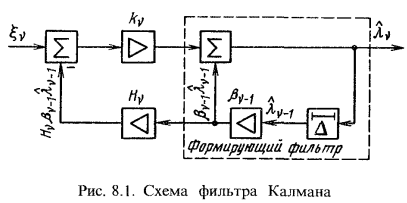

# 3 Исследование особенностей построения и ТТХ метеорологических РЛС

## 3.1 Алгоритмы и структурные схемы неследящих и следящих измерителей параметров (времени прихода, частоты, фазы, амплитуды и т.п.) когерентных и некогерентных сигналов

Когда измеряемый параметр является случайной величиной, распространенными являются оценки максимального правдоподобия выполняемые по максимуму функции/отношения/логарифма отношения правдоподобия. Они будут совпадать с Байесовскими оценками при постоянном априорном распределении параметра и простой функции потерь.

Вычисление тогда проводится следующим образом
$$
    \left.\frac{\partial L[z(t)|\lambda]}{\partial\lambda}\right|_{\lambda = \widehat{\lambda}} = 0
$$

При полностью известном сигнале оценка будет определятся максимумом функции
$$
    \frac{2}{N_0}\intop_0^{\Delta T}z(t)S(t, \lambda)dt - \frac{1}{N_0}\intop_0^{\Delta T}S^2(t, \lambda)dt
$$

При сигнале с неизвестной начальной фазой амплитудой максимум будет определятся функцией
$$
    \text{ln}I_0\left(\frac{2}{N_0}\intop_0^{\Delta T}\dot{z}^*(t)\dot{S}(t, \lambda)dt\right) - \frac{1}{N_0}\intop_0^{\Delta T}S^2(t, \lambda)dt
$$

Общая структура следящего/неследящего измерителя будет

Структура измерителя фазы

Структура измерителя задержки

Структура измерителя частоты

Для измерителя пачки импульсов сначала ставится когерентный/некогерентный накопитель

---

## 3.2 Линейная фильтрация

Задача фильтрации - оценивания при изменении во времени параметра. При входном процессе $z(t)=S(t,\lambda_1(t))+n(t)$, с минимальной погрешностью получить оценку $\widehat{\lambda}_1(t)$ (на основе текущего и прошлых данных), и, возможно, получить прогнозную оценку $\widehat{\lambda}_1(t_{зад})$.

Линейная фильтрация - когда наблюдение и сообщение имеют линейную зависимость от $\lambda$. Начальное значение параметра $\lambda$ распределено но нормальному закону. Или, когда сигнал и помеха являются гауссовыми процессами и взаимодействуют аддитивно.

Нелинейная фильтрация - если наблюдение или сообщение содержат нелинейные функции от параметра $\lambda$, или если $\lambda_0$ распределена не по нормальному закону.

### Задача линейной фильтрации в дискретном случае.

Дано наблюдение $z_m = s(t_m, \lambda_m) + n_m$, зависящее от параметра $\lambda_m = g(t_m, \lambda_{m-1}) + n_{\lambda m}$.

При известном $W[\lambda_{m-1}|z_0^{m-1}]$ для момента времени $t_{m-1}$ найти апостериорную вероятность $W[\lambda_m|z_0^m]$ и затем вычислить оценку $\hat{\lambda}_m$ в момент $t_m$
$$
    \hat{\lambda}_m = \int\lambda_m W[\lambda_m|z_o^m]d\lambda_m
$$

По формуле Байеса получим
$$
    W[\lambda_m, z_m|z_0^{m-1}] = W[\lambda_m|z_0^{m-1}]\cdot W[z_m|z_0^{m-1},\lambda_m] = W[z_m|z_0^{m-1}]\cdot W[\lambda_m|z_0^{m-1}, z_m]
$$

Поскольку $z_m$ не зависит от предыдущих значений шума
$$
    W[z_m|z_0^{m-1},\lambda_m] = W[z_m|\lambda_m]
    \\
    W[\lambda_m|z_0^{m-1},z_m] = W[\lambda_m|z_0^m]
$$

Тогда получаем
$$
    W[\lambda_m|z_0^{m}] = W[\lambda_m|z_0^{m-1}] \cdot W[z_m|\lambda_m]/W[z_m|z_0^{m-1}]
$$

Множитель в знаменателе выводим как константу. $W[z_m|\lambda_m]$ выводится из наблюдения.
$$
    W[\lambda_m|z_0^{m-1}] = \intop_{-\infty}^{\infty}W[\lambda_{m-1}|z_0^{m-1}] \cdot W[\lambda|\lambda_{m-1}]d\lambda_{m-1}
$$

Первый множитель дан из условия, второй выводится из наблюдения. Оптимальным решением для линейной фильтрации в смысле минимума СКО является фильтр Калмана.

---

## 3.3 Фильтр Калмана

При нормальном распределении помехи фильтр Калмана является оптимальным по критерию минимума СКО.

Представим входной процесс в виде
$$
    z_k = \lambda_k + n_k
$$
А входной параметр в виде
$$
    \lambda_k = \rho_k \lambda_{k-1} + \xi_k
$$

Пусть дисперсия шумов параметра и процесса меняется на каждом шаге
$$
    V_{\xi_k}, V_k
$$

Пусть известна оценка и дисперсия ошибки оценивания $k - 1$
$$
    \hat{\lambda}_{k-1}, P_{k-1} = M\{(\hat{\lambda}_{k-1} - \lambda_{k-1})^2\}
$$

Тогда прогноз будет и его дисперсия будет
$$
    \hat{\lambda}_{эк} = \rho_{k-1}\hat{\lambda}_{k-1}
    \\
    M\{(\hat{\lambda}_{эк} - \lambda_{k})^2\} = \rho^2_{k-1}P_{k-1} + V_{\xi_k}
$$

Объединив оценки получим
$$
    \lambda_k = \frac{V_k}{P_{эк} + Vk}\hat{\lambda}_{эк} + \frac{P_{эк}}{P_{эк} + Vk}z_k
$$

Переписав в более общей форме
$$
    \lambda_k = \hat{\lambda}_{эк} + \frac{P_k}{V_k}(z_k - \hat{\lambda}_{эк})
$$

Тогда вид фильтра будет

---

## 3.4 Оптимальная нелинейная фильтрация

Когда наблюдение
$$
    z(t_m) = s(t_m, \lambda(t_m)) + n_0(t_m),
$$
или сообщение
$$
    \lambda = g(t_m, \lambda_{m-1}) + n_\lambda(t_m),
$$
являются нелинейными функциями от $\lambda$, или если начальное значение $\lambda_0$ не является нормальной случайной величиной.

Общая задача формулируется ви выводится как в линейной фильтрации.

---

## 3.5. Гауссовское приближение в теории нелинейной фильтрации

Вокруг точки интереса ПВ аппроксимируется линейно. Вокруг рассматриваемой точки функция раскладывается в ряд Тейлора, в котором отбрасываются члены выше первого порядка. Т.е. предполагается, что нелинейные функции достаточно гладкие, что их можно аппроксимировать полиномом первого порядка.

Тогда если входной параметр
$$
    \lambda_m = f(\lambda_{m-1}) + n_{\lambda m}
$$
а наблюдение
$$
    z_m = h(x_m) = n_{zm}
$$

Алгоритм похож на алгоритм линейный Калмана

$$
    \hat{\lambda}_{m|m-1} = f(\hat{\lambda}_{m-1})
    \\
    P_{m|m-1} = J_{f, m-1}P_{m-1}J^T_{f, m-1} + Q_{m-1}
    \\
    K_m = P_{m|m-1}H^T_{h,m}(J_{h,m}P_mJ^T_{h,m} + R_m)^{-1}
    \\
    \hat{\lambda}_m = \hat{\lambda}_{m|m-1} + K_m(z_m - h(\lambda_m))
    \\
    P_m = (I - K_mH_{h, m})P_{m|m-1}
$$

---

## 3.6 Структурные схемы оптимальных аналоговых измерителей дальности и скорости

В общем случае фазовый дальномер это измеритель по задержке, а частотный дальномер это измеритель по банку фильтров.

### Фазовый дальномер

$$
    \Delta \varphi = 2\pi\frac{D}{\lambda} = 2\pi\frac{c\tau}{\lambda_м}
    \\
    D = \frac{\Delta\varphi \cdot \lambda}{2\pi} = \frac{\Delta\varphi \cdot c}{2\pi f_М}
$$
Однако на объекте будет добавляться свой сдвиг фазы при отражении. Для повышения точности нужно повысить частоту, что понизит однозначность, т.е. излучают на нескольких шкалах.

Для однозначного определения необходимо
$$
    \Delta D \le \frac{\lambda}{2}
$$
Поэтому измеряют не на несущей частоте.

Применяется разностно-дальномерный метод от двух маяков
$$
    \Delta \varphi = 2\pi\frac{D_2 - D_1}{\lambda}
$$

Чтобы исключить влияние сдвига фазы при отражении от цели применяют схему $(2)$ и излучают на масштабируемой частоте.

Схема фазового дальномера

### Частотный дальномер

Схема частотного дальномера

Измеряет частоту с помощью ЛЧМ сигнала по разности принятых частот

При пилообразной форме напряжения
$$
    \frac{F_б}{\tau} = \frac{\Delta f}{T_М}
    \\
    \tau = \frac{F_б T_M}{\Delta f}
$$

При треугольной форме
$$
    \tau = \frac{F_б T_M}{2\Delta f}
$$

Разрешение по дальности
$$
    \delta\tau = \frac{1}{\delta f}
$$

### Импульсный дальномер

Измеряет по времени задержки.

### Измеритель скорости

По частотному сдвигу.

---

## 3.7 Структурные схемы измерителей угловых координат для моноимпульсных устройств и антенных решеток

### Амплитудный угломер

Угол цели извлекается из сравнения параметров сигналов, принятых по различным приемным каналам.

Логарифмический УПЧ ослабляет зависимость от уровня сигнала, но не уберет ее совсем. ВУ - вычитающее устройство.

Дискриминационная характеристика будет
$$
    U(\theta_ц) = \ln\frac{f_а(\theta_0 + \theta_ц)}{f_a(\theta_0 - \theta_ц)}
$$
$f_a$ - значение нормированной ДНА

### Фазовый угломер

Искомый угол $\theta$
$$
    \Delta\varphi = \varphi_1 - \varphi_2 = 2\pi\frac{\Delta r}{\lambda} = 2\pi\frac{d}{\lambda}\sin(\theta)
$$

### Суммарно-разностный угломер

Информация об угле содержится в амплитуде отношения, а знак в разности фаз суммарного и разностного канала.
$$
    U(\theta_ц) = \frac{U_\Delta(\theta_ц)}{U_\Sigma(\theta_ц)}\cos(U_\Delta\angle U_\Sigma)
$$

Угол при одной цели от 0 до $\pi/2$.

### Моноимпульсный измеритель с ФАР

Применяют фазированную антенную решетку с весовыми коэффициентами, чтобы обеспечить суммарную и разностную диаграмму.

---

## 3.8 Структурные схемы устройств приема и обработки радионавигационных сигналов: доплеровских измерителей скорости, радиотехнических систем ближней и дальней навигации и т.п.

Измеритель скорости делается через измеритель частоты Доплера.

### Система дальней навигации

Система дальней навигации Лоран-А/С

Излучаются импульсы маяками, корабль определяет положение по разностно-дальномерному методу.

Одна ведущая станция, остальные ведомые. по разности времен разность дальностей и грубое местоположение. По разности фаз точное положение. Сигнал излучается с частотной манипуляцией с кодом Фрэнка. С определенными дискретами изменяется несущая частота. Это обеспечивает защиту от переотражений.

### Система ближней навигации

РСБН-ПРМГ.

Измерение текущей дальности D (t) во всех радиосредствах ближней навигации основано на измерении времени запаздывания ответного сигнала относительно момента посылки запросных сигналов. Для этого используется метод активной радиолокации с активным ответом, называемым принципом «запрос-ответ». На основе данного принципа построен импульсный радионавигационный дальномер с ответчиком, в котором имеются два канала связи: запроса и ответа.

Для определения текущего азимута Аз (t) в радиосредствах ближней навигации применяют как временные, так и фазовые радионавигационные устройства. Во временных устройствах информация об азимуте заложена в сдвиге по времени импульса (азимутального сигнала), который принимается на ЛА, относительно сигнала начала отсчета времени, излучаемого радиомаяком и соответствующего нулевому азимуту (северный сигнал). В фазовых радионавигационных устройствах информация об азимуте содержится в фазовом сдвиге огибающей сигнала, принимаемого на ЛА, относительно опорного сигнала, излучаемого радиомаяком и соответствующего азимуту, равному 0.

---

## 3.9 Цифровые измерители дальности и угловых координат

Измерители дальности в п. 3.6 - 3.7.

Цифровой измеритель фазы может быть основан на заполнении импульсами промежутка между нулями 2х сигналов. Соответственно, так может быть реализован цифровой фазовый дальномер.

Угломер (помимо моноимпульсных).

## Метод максимума

Поиск по максимуму ДН антенны. Ошибка зависит от ширины ДН.

## Равносигнальный метод

Две диаграммы, пересекающиеся на равносигнальном направлении. Для нивелирования влияния уровня сигнала, реализуются суммарные и разностные диаграммы.

---

## 3.10 Принципы измерения параметров траектории движения целей

Результаты первичной обработки информации дают точки в пространстве с координатами (в сферической или декартовой системе), которые служат для начала или продолжения траекторий.

Новые отметки принимаются за исходные точки начала траектории новой цели. При известных границах скорости цели, можно очертить диапазон, в котором цель может оказаться из этой траектории. Эта граница представляется в виде 2х окружностей (по минимальной и максимальной скорости). Формирование областей - стробирование, сами области - стробы.

По двум отметкам в стробе можно вычислить скорость и направление движения цели, исходя из чего спрогнозировать положение цели в следующий строб. Вокруг экстраполированных отметок снова отмечаются стробы, размеры которых определяются из возможных ошибок оценок.

Имеется два подхода к оценки траектории движения.

Первый метод, параметрический. На основе метода наименьших квадратов или оценки максимального правдоподобия. В них предполагается идеальная модель движения, и дисперсия оценки по мере увеличения интервала наблюдения стремится к 0. По мере того как она уменьшается, уменьшается выигрыш от новых данных. Интервал времени, в котором эти модели применяются ограничивается, т.к. все модели на практике неидеальны.

Вторая группа основана на фильтрации (с помощью фильтра Калмана или альфа-бета фильтра). Они предполагают неидеальную модель, в которой есть шумовая составляющая. По мере увеличения, дисперсия оценок установится до какого-то фиксированного значения.

При параметрической оценке модель движения описывается как
$$
    X_{k+1} = F_k X_k
    \\
    Z_{k} = H_k X_k + w_k
$$
где $X_k$ - вектор состояния в момент $t_k$, $F_k$ - модель движения из времени $t_k$ в $t_{k+1}$, $Z_k$ - вектор измерений в момент $t_k$, $H_k$ - вектор преобразования из парамера в состояния, $w_k$ - это гауссов случайный процесс.

Пример для модели движения с почти постоянной скоростью

$$
    \begin{bmatrix}
        x_{k+1} \\
        v_{k+1}
    \end{bmatrix}
    =
    \begin{bmatrix}
        1 & \delta t \\
        0 & 1
    \end{bmatrix}
    \begin{bmatrix}
        x_{k} \\
        v_{k}
    \end{bmatrix}
    \\
    Z_k =
    \begin{bmatrix}
        1 & 0
    \end{bmatrix}
    \begin{bmatrix}
        x_{k} \\
        v_{k}
    \end{bmatrix}
    + w_k
$$

В стохастическом методе модель описывается в виде
$$
    X_{k+1} = F_k X_k + G_k v_k
    \\
    Z_{k} = H_k X_k + w_k
$$
где $v_k$ - ошибки в оценках.

---

## 3.11 Особенности фазовых и частотных измерений

Схема измерителя частоты и фазы (оптимальная). Их ошибки.

---

## 3.12 Многоканальные измерители

Моноимпульсный пеленгатор представляет из себя многоканальное устройство. Многоканальные корреляционные схемы для измерителей.

---

## 3.13 Принцип измерений с использованием данных пассивной радиолокации

Разность дальностей по разности фаз от 2х маяков. Так же импульсный метод измерения дальности.

$$
    r = \frac{2Б^2 - R_1^2 - R_2^2}{2(R_1 + R_2)}
$$

---

## 3.14 Синтез и оценка потенциальной точности и помехоустойчивости дальномерных, разностно-дальномерных, угломерных и доплеровских устройств приема и обработки информации в радионавигационных системах

### Импульсная дальномерная система

Минимальная дальность действия будет определятся временем излучения зондирующего импульса и временем, необходимым на переключение из приемного режима в передающий.
$$
    D_{min} = \frac{c}{2}(\tau_p + \tau_{sw})
$$

Максимальная дальность для пачки импульсов будет определятся однозначным определением дальности
$$
    D_{max} = \frac{c}{2}(T_p - \tau_p)
$$

И из уравнения радиолокации
$$
    P_{ref} = \frac{P_t \cdot G_t \cdot \sigma}{4\pi R^2}
    \\
    P_{rx} = \frac{P_{ref} \cdot S_a}{4\pi R^2}, S_a = \frac{G_r \cdot \lambda^2}{4\pi}
    \\
    SNR = \frac{P_{rx}}{P_n} = \frac{P_{ref} \cdot G_r \cdot \lambda^2}{(4\pi)^2 R^2 kT_0B}
$$

Уменьшение ЧПИ увеличивает максимальную дальность, но при этом потенциально уменьшает ОСШ, т.к. меньше число импульсов, которые мы можем излучить.

$$
    n = \frac{\text{Ширина ДНА} \cdot F_p}{\text{Скорость сканирования}}
$$

Разрешение по дальности для простого/сложного сигнала будет
$$
    \delta R = \frac{c}{2}\tau_и
    \\
    \delta R = \frac{c}{2}\frac{1}{B}
$$

Потенциальная точность измерения дальности по границе Крамера-Рао будет
$$
    D[\hat{\tau}|\tau] = \frac{1}{q2\pi f_э}
$$

Частотный сдвиг можно измерять по пачке импульсов. Пачка для этого должна излучаться когерентно. Разрешение по частоте будет
$$
    \delta f = F_п/N_п
$$

И максимальная однозначная частота будет
$$
    F_{\max} = \plusmn F_п/2
$$

Точность измерения угла в данном случае будет определятся по методу максимума, и будет определятся шириной ДНА.
$$
    \sigma_\varphi = \frac{\text{Ширина главного лепестка}}{\sqrt{q\pi}}
$$

---

## 3.15 Оптимальная обработка радионавигационных сигналов, поступающих от нескольких измерителей

Если информация поступает от нескольких измерителей
$$
    \xi_m = s(t_m,\lambda_m) + n_m
    \\
    \nu_m = g(t_m, \lambda_m) + \varepsilon_m
$$

Оптимальное комплексирование будет осуществляться
$$
    W[\lambda_m|\xi_0^m, \nu_0^m] = C \cdot W(\xi_m - s(t_m,\lambda_m))\int W[\lambda_{m-1}|\xi_0^{m-1},\nu_0^{m-1}] \cdot W[\lambda_m|\lambda_{m-1}] \times
    \\
    \times W[\nu - g(t_m,\lambda_m)|\nu_{m-1} - g(t_{m-1}, \lambda_{m-1})] d\lambda_{m-1}
$$

Оптимальная оценка по критерию минимума среднего квадрата ошибки будет
$$
    \hat{\lambda}_m = \int\lambda_m W[\lambda_m|\xi_0^m, \nu_0^m]d\lambda_m
$$

---

## 3.16 Оптимизация доплеровских и инерциально-доплеровских комплексных систем навигации.

Доплеровская система навигации. Самолет излучает на фиксированной частоте сигнал, и принимает отраженный от земли сигнал со сдвигом. Измеряя его он получает свою скорость.

---

## 3.17 Коррекция комплексных систем навигации от радиотехнических измерителей

Использования СРНС для начальной привязки и коррекции систематической ошибки в НРНС.

В НРНС можно использовать дифференциальный режим для устранения систематической погрешности. Опорный пункт с известными координатами принимает сигнал и вычисляет погрешность измерения. Дальше поправки передаются потребителю. Комплексирование параметров возможно с применением фильтра Калмана.

---

## 3.18 Особенности построения измерителей параметров сигналов инфракрасного и оптического диапазонов волн

смотри пункт 2.14
