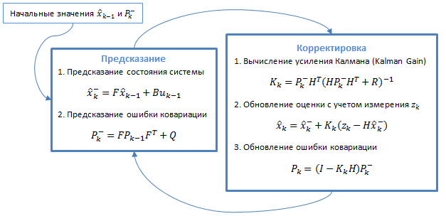
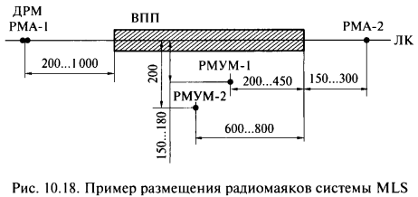
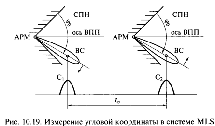
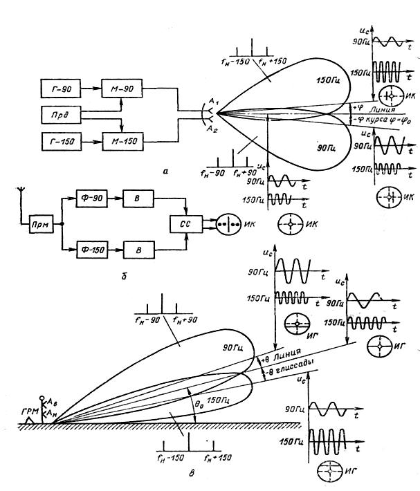

# 6. Третьи вопросы

## 6.1 проблемы создания спутниковой системы посадки категории III

Целостность системы - вероятность обнаружения ошибки за заданное время после поломки. Недостаточная помехозащищенность для 3ей категории (чувствительность к переотражениям). Возможно применение дифференциального режима для улучшения обстановки.

---

## 6.2 Общие принципы теории нелинейной обработки марковских процессов. Уравнение Стратановича Р.Л.

Уравнение Стратановича при фильтрации в непрерывном времени (аналоговой фильтрации) полностью описывает эволюцию апостериорной плотности вероятности состояния $\lambda$. Это теоретически решает задачу фильтрации, позволяя дать оценку $\hat{\lambda}$ по любому критерию.

Само уравнение описывается

$$
    \frac{\partial p(t,\lambda|\xi_0^t)}{\partial t} = L[p(t, \lambda|\xi_0^t)] + \left[F(t, \lambda) - \int F(t, \lambda)p(t, \lambda|\xi_0^t)d\lambda\right]p(t, \lambda|\xi_0^t)
    \\
    F(t, \lambda) = s^T(t, \lambda)\frac{1}{N_0}[\xi(t) - (1/2)s(t, \lambda)]
$$

где $\lambda$ - состояние, $\xi$ - измерение, $L[\cdot]$ - оператор Фоккера-Планка-Колмогорова, $p(\cdot)$ - плотность вероятности, $\xi(t)=s(t, \lambda) + n_0(t)$

---

## 6.3 Требования к вычислительной платформе, осуществляющей оптимальную фильтрацию Калмана

Фильтр Калмана должен выполнить:
1. Вычислить предсказание (экстраполированное значение) параметра системы
2. Вычислить предсказание ошибки ковариации
3. Рассчитать коэффициент усиления фильтра Калмана
4. Вычислить скорректированное значение векторов параметра системы
5. Обновить ковариационную матрицу погрешностей

Фильтр Калмана - фильтр с растущей памятью, соответственно он требует увеличивающейся памяти вычислительной системы.

---

## 6.4 Принципы построения микроволновых систем посадки в стандартном диапазоне в 5 ГГц

Системы MLS разрабатываются с 1970-х годов. В них используются радиоволны с частотой 1 и 5 ГГц. Также как и в системах ILS, на аэродромных полосах устанавливается два радиомаяка MLS. Один из них отвечает за определение самолетом азимута, другой — за определение угла места. В отличие от ILS, сигналы MLS имеют узкую диаграмму направленности и сканируют своим лучом широкий сектор с известной скоростью.

Принципиальным отличием СП сантиметрового диапазона является обеспечение посадки по траектории, оптимальной для данного типа ВС. Линия курса и глиссады определяется на борту ВС на основе сравнения измеренных значений углов в горизонтальной и вертикальной плоскостях с заданными.

В качестве дальномерной системы используется DME/P.

- азимутальный радиомаяк РМА-1, обеспечивающий определение углового положения самолета относительно линии курса. Построение системы предусматривает два режима: с низкой (функция Аз-1) и высокой (функция АзС-1) частотой повторения (табл.
- азимутальный радиомаяк РМА-2, предназначенный для определения углового положения самолета относительно курса посадки при уходе на второй круг (функция Аз-2);
- угломестный радиомаяк РМУМ-1, обеспечивающий определение угла в вертикальной плоскости при снижении самолета (функция УМ-1);
- угломестный радиомаяк РМУМ-2, обеспечивающий определение угла в вертикальной плоскости при выравнивании самолета (функция УМ-2).

Схема MLS

Кроме угловых параметров в угломерной подсистеме передаются основные и вспомогательные посадочные данные, а также сигналы клиренса, указывающие направление выхода в сектор пропорционального наведения при большом отклонении самолета от линии курса.

У каждой функции сигналы разделены по частям. Непосредственно измерение в части скан.

Во время скана ДН электронным сканированием движется с одного края к другому и излучает импульсы. На борту получаются 2 сигнала, временной интервал между которыми однозначно связан с углом. Проблемы с измерением угла при наличии переотражателя.

Угол определяется в поле скан по времени между сканированиями. Излучается немодулированная частота.

---

## 6.5 Существующие типы инструментальных систем посадки самолетов гражданской и государственной авиации

Категории посадки - 1, 2, 3а, 3б, 3с
Делятся по высоте принятия решения (> 60 м, 30 - 60 м, 15 - 30 м, 0, 0) и дальности видимости ориентиров на высоте принятия решения (3с - 0, полностью автоматическая система)

Есть метровая система, дециметровая и сантиметровая система

3 канала - курс, глиссада, дальномерный.

Курс - отклонение от середины линии. Глиссада - линия посадки и отклонение от нее. Дальномерный

### 6.5.1 Метровая система (~100 МГц несущая), ILS (Instrument landing System, СП-50/СП-70)

Канал курса (108 - 112 МГц) - равносигнальный маяк за полосой, формирует 2 диаграммы с равносигнальным направлением вдоль оси полосы. Выдаются с амплитудной модуляцией на одной диаграмме 90 Гц, не другой 150 Гц. На приемнике каналы разделяются фильтром и угол извлекается из разности глубин модуляции.

Сектор, где РМ курса будет работать в пределе сектора пропорционального наведения. Для контроля того, что самолет остался в этом секторе, в системах 2 категории добавляют канал клиренса. Работает так же, как основной канал, но ДН шире. Он способствует выходу в более узкий канал и борьбе с переотражением.

Канал глиссады (328,6 - 335,4 Мгц) - стоит РМ, с центром, настроенным на глиссаду. Обычно тоже равносигнальный метод, но на других частотах. Так же нужен канал клиренса для 2ой категории.

Дальномерная система (DME/P). Современная - запросно-ответный радиомаяк, по времени обеспечивает измерение наклонной дальности, на борту пересчитывается в реальную дальность. Ранее вычислительных возможностей не хватало, поэтому использовалась маркерная система. Маркеры стоят на фиксированных дальностях, когда пилота необходимо осуществить какие-либо действия.

Недостатки - угол глиссады фиксирован, система долго развертывается.

### 6.5.2 Дециметровая система (РСБН-ПРМГ)

Отечественная РСБН-ПРМГ. ПРМГ - посадочная радиомаячная группа. Официально только система военных. Примерно те же сигналы. В метровом диапазоне непрерывные сигналы с непрерывным сигналом.

В дециметровом излучается модулированные по амплитуде сигналом типа меандр пачка импульсов в одну диаграмму, затем в другую. Амплитуда запоминается на пиковом детекторе.

РСБН-ПРМГ единый комплекс, и это одни частотные каналы, переходящие в другой.

Система значительно более мобильная, чем метровая, но в остальном недостатки те же. Глиссада фиксирована.

### 6.5.3 Сантиметровая система (ССП/MLS - Microwave Landing System)

Решаемые задачи - определение азимута при заходе на посадку (Аз1), при уходе на второй круг (Аз2), угол места ри заходе на посадку (Ум1), угол места при выравнивании (Ум2). Передача навигационных данных (направление, сила ветра, состояние полосы.

Для различных функций заложено временное разделение. У разных функций разная частота повторения. Самая большая частота повторения - угол места (глиссада).

У каждой функции сигналы разделены по частям. Непосредственно измерение в части скан.

Во время скана ДН электронным сканированием движется с одного края к другому и излучает импульсы. На борту получаются 2 сигнала, временной интервал между которыми однозначно связан с углом. Проблемы с измерением угла при наличии переотражателя.

Потом в сообщении контрольные сигналы для контроля аппаратуры.
