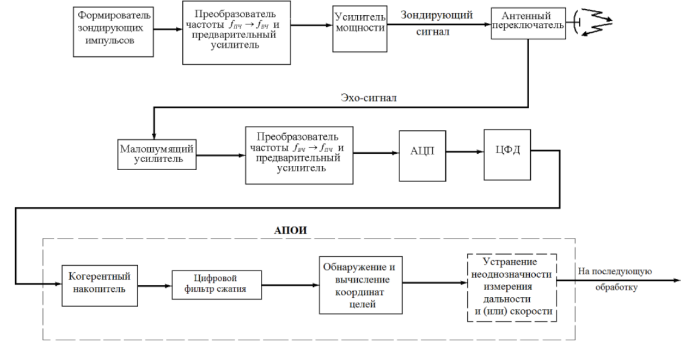

# 2.1 Первичные радиолокаторы в системах управления воздушным движением

## Этапы извлечения и обработки радиолокационной информации
1. Обнаружение полезных сигналов
2. Определения координат и параметров движения радиолокационных целей
3. Обнаружение траектории цели по совокупности радиолокационных отметок
4. Слежение за траекторией цели
5. Траекторные расчеты по каждой цели (сглаживание, прогнозирование)
6. Объединение информации, получаемой из нескольких источников

---

## Когерентно-импульсная РЛС со сжатием ложных сигналов

ЦФД - цифровой фазовый детектор. Формирует действительные (косинусные) и мнимые (синусные) квадратурные каналы оцифрованного сигнала в цифровой форме. После него идут уже два квадратурных сигнала. С выхода АПОИ сигнал поступает на вторичную (траекторную) обработку. Реализуется на основе интегрированных схем или ПЛИС.

АПОИ - аппаратура первичной обработки информации.

Для формирования зондирующих импульсов применяются схемы прямого цифрового синтеза (ПЦС) вместо устройств на поверхностных акустических волнах (ПАВ) или генераторах, управляемых напряжением (ГУН). Схемы ПЦС позволяют сформировать сигнал с любым видом модуляции.
