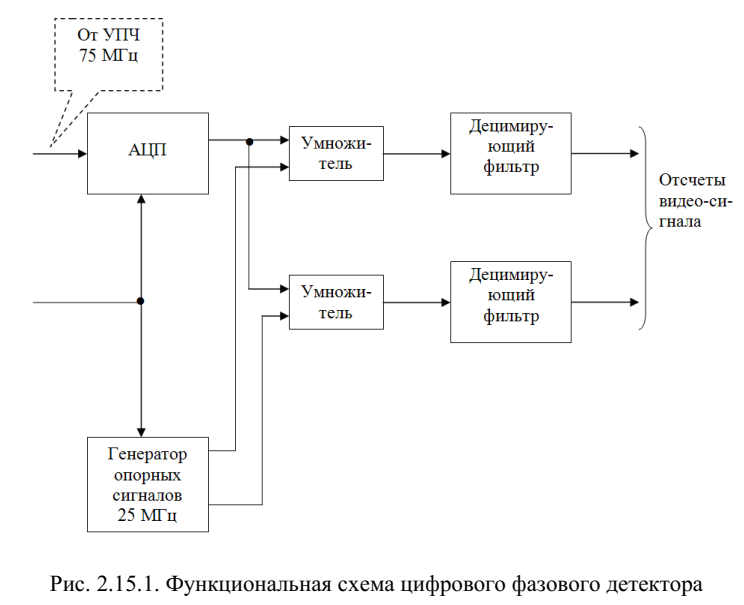
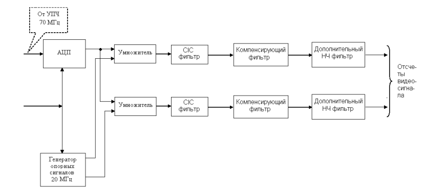

# 2.3 Классификация методов повышения эффективности сжатия сложных сигналов

## Методы достижения оптимального сочетания характеристик эффективности сжатия

1. Аппаратные. Сжатие достигается синтезом устройств обработки при заданном сигнале на его входе. К ним относятся методы подоптимальной обработки сложных радиолокационных сигналов. Обработка ведется в частотной или временной области.
2. Заданные характеристики сжатого сигнала достигаются только синтезом сигнала. Реализуются в устройствах согласованной обработки. Методы синтеза сигналов с нелинейной частотной модуляцией, фазовой манипуляцией (коды Баркера). Достоинство - применение согласованного фильтра в приемнике.
3. Комбинированные методы - синтез и сигнала и фильтра.

---

## Двумерная функция неопределенности
Выход фильтра сжатия в зависимости от запаздывания сигнала и отклонения его частоты от исходной.
От длительности сигнала зависит разрешающая способность и точность измерения по скорости, от ширины спектра, разрешающая способность и точность по дальности.
Исследования двумерной функции неопределенности позволяет найти потенциальную точность РЛС в отношении точности, разрешающей способности и однозначного измерения дальности и скорости.

При использовании СФ функция неопределенности будет АКФ сигнала. АКФ определяется выражением
$$ \tag{2.5.1, стр. 149}
 \psi(\tau, f_D) = \text{Re}\frac{1}{2}\text{exp}(j2\pi f_0\tau)\intop_{-\infty}^{\infty}\dot{U}(t)U^*(t - \tau)\text{exp}(j2\pi f_Dt)dt
$$

---

## Синтез сигналов с внутриимпульсной фазовой манипуляцией
ФМ сигналы - импульсные или непрерывные сигналы с многократными скачками фазы несущей. Сигналы могут быть с двоичной фазовой манипуляцией, либо полифазные сигналы.

Комплексная огибающая ФМ сигнала будет
$$
    s(t) = \frac{1}{\sqrt{\tau_C}}\sum_{m = 1}^{n_B}\text{exp}(j\phi_m)rect\left[ \frac{t - (m - 1)T_P}{T_P} \right]
$$
где $n_B$ - число дискретов, $T_P$ - длительность дискрета, $\tau_C$ - длительность ФМ сигнала.

---

## 2.3 Характеристики эффективности сжатия сложных радиолокационных сигналов
Основными характеристиками эффективности сжатия являются:
- Пиковый и средний УБЛ на выходе ФС
- Энергетический выигрыш  ФС (повышение ОСШ за счет ФС)
- Ширина основного лепестка отклика ФС (по уровню 3 дБ)
- Уровень УБЛ при наличии доплеровских сдвигов
- При использовании ФС, отличных от согласованных - потери в ОСШ

Уровни боковых лепестков измеряются как
$$
    L = 20\text{lg}\left(\frac{U_S}{U_m}\right)
$$

---

## 2.4 Сравнительный анализ кодов фазовой манипуляции, используемых совместно с согласованным фильтром
Коды Баркера. Имеют уровень боковых лепестков равный $1/n_B$.

Коды, описываемые линейными рекуррентными цифровыми последовательностями. Для того, чтобы тало неопределенности ФМ сигнала приближалось по форме к телу неопределенности шумоподобного сигнала, необходимо изменять фазу от одного дискрета к другому по случайному закону. При этом начальные фазы должны равновероятно принимать все значения. Период последовательности - максимальная длина неповторяющихся чисел в последовательности. Задаваясь комбинацией чисел, определяют всю последовательность. Широкое распространение получили М-последовательности.

Коды с минимальным уровнем боковых лепестков. Коды, которые обеспечивают наименьший УБЛ при согласованном сжатии, но не удовлетворяющие по требованию кодам Баркера. Их находят путем перебора.

Дополнительные коды. Состоят из двух кодовых последовательностей с одинаковым количеством элементов. АКФ указанных последовательностей имеет боковые лепестки одинаковой амплитуды и противоположного знака. При их суммировании боковые лепестки отсутствуют. Последовательности разделяют по частое, времени или поляризации.

---

## 2.5 Сравнительная оценка эффективности методов подоптимальной обработки ФМ сигналов
Основные задачи подоптимальной фильтрации
- Минимизация УБЛ
- Минимизация энергетических потерь
- Уменьшение расширения основного лепестка отклика ФС
- Уменьшение чувствительности к доплеровским сдвигам частоты

Способы решения задачи снижения УБЛ
- Сигнал сжимается при помощи СФ, далее сжатый сигнал поступает на вход подоптимального фильтра. используются R-G фильтры
- Использование подоптимального фильтра сжатия без СФ. При синтезе таких фильтров используются алгоритмы минимальной среднеквадратической ошибки или линейного программирования.

---

## 2.6 Сравнительная оценка тел неопределенности при согласованном и подоптимальном сжатии ФМ сигналов

## 2.7 Особенности применения подоптимальных фильтров сжатия в приемниках РЛС

---

## 2.8 Весовая обработка сигналов с линейной частотной модуляцией
Весовая обработка заключается в умножении на весовую функцию АЧХ или импульсной характеристики (ИХ) СФ, что соответствует весовой обработке (ВО) в частотной или временной области.
Пример ВО для комплексного ЛЧМ сигнала
$$
    \dot{s}(t) = \begin{cases}
        g(t)\text{exp}(j\pi\Delta F_{ЛЧМ}t^2/\tau), &|t| \le \tau/2 \\
        0, &|t| > \tau/2
    \end{cases}
$$
Тогда ИХ согласованного фильтра будет
$$
    \dot{h}(t) = \begin{cases}
        w(t)\dot{s}^*(-t), &|t| \le \tau/2 \\
        0, &|t| > \tau/2
    \end{cases}
$$
Тогда сигнал на выходе будет
$$
    \dot{s}_{вых}(t) = \intop_{-\infty}^{\infty}\dot{s}_0(t')w(t - t')\dot{s}_0^*(t' - t)dt'
$$
При весовой обработке в области АЧХ
$$
    \dot{H}(f) = w(f)\dot{S}^*(f)
$$

---

## 2.9 Анализ эффективности весовой функции при обработке ЛЧМ сигнала в частотной области
Для реализации весовой обработки применяются весовые фильтры (ВФ).
Их основные показатели качества:
- Максимальный УБЛ
- Вид боковых лепестков
- потери рассогласования
- Длительность главного лепестка по уровню -3 дБ
- Высота пьедестала (амплитуда ВФ на краях полосы $f = \plusmn\Delta F/2$ при условии, что функция нормирована таким образом, что в центре имеет единичную амплитуду

---

## 2.10 Согласованное сжатие сигналов с нелинейной частотной модуляцией
Методы синтеза сигналов с нелинейной частотной модуляцией (НЧМ)
- Метод стационарной фазы
- Метод оптимизации в частотной области
- Метод оптимизации по временной области

---

## 2.11 Особенности построения цифровых фазовых детекторов
Свойства ЦФД
- Преобразование аналогового сигнала в цифровую форму осуществляется на промежуточной частоте, при этом ширина полосы преобразованного сигнала значительно меньше частоты преобразования
- АЧХ ЦФД определяет АЧХ всего приемного тракта
- За счет осуществления синусного и косинусного преобразования в цифровой форме достигается высокая степень ортогональности

В примере сигнал отображается в первую зону Найквиста, и с нее переносится.

---

## Фильтры в ЦФД
НЧ фильтрация может осуществляться в децимирующих CIC (cascaded integrator-comb) фильтрах, имеющих в своем составе только сумматоры и регистры. Однако они, как правило, не обеспечивают необходимую крутизну спада АЧХ.
Т.к. требуется линейная ФЧХ, БИХ фильтры не используются.
Для достижения требуемой АЧХ применяются КИХ фильтры.
Если используется CIC фильтр, добавляется компенсирующий КИХ фильтр для компенсации наклона АЧХ.

---

## 2.12 Расчёт основных характеристик первичного радиолокатора

## Точность измерения дальности
Точность измерения дальности ЛА определяется
- Отношение С/Ш
- Эффективная полоса спектра зондирующего сигнала
- Нестабильность условий распространения радиоволн
- Разброс положения кажущегося центра отражения ЛА

Погрешность будет определятся из неравенства Крамера-Рао
$$
    \sigma_t^2 = \frac{1}{q\Delta F_э^2}
$$
$F_э^2$ - эффективная ширина спектра сигнала. Для простых сигналов $F_э = \sqrt{\pi}/\tau_и$

$q$ можно определить как отношение амплитуды импульса к СКО шума $A$ с учетом эффективно интегрируемых импульсов $M$
$$ \tag{2.16.5, стр. 174}
    q = A^2M
$$
Тогда СКО потенциальной погрешности измерения времени запаздывания будет
$$ \tag{2.16.7, стр. 174}
    \sigma_t = \tau_и/(A\sqrt{\pi M})
$$
СКО погрешности измерения дальности будет
$$ \tag{2.16.8, стр. 174}
    \sigma_R = c \cdot\tau_и/(2A\sqrt{\pi M})
$$

---

## Составные части погрешности измерения дальности
1. Погрешности измерения дальности, обусловленная точностью установки нуля дальности $\sigma_0$
2. Погрешность измерения дальности, обусловленная нестабильностью опорного генератора
$$
    \sigma_{кг} = R_{max}\sqrt{\delta_д^2 + \delta_к^2}
$$
$\delta_д^2$, $\delta_к^2$ - долговременная и кратковременная нестабильность генератора. $R_{max}$ - максимальная дальности действия локатора

3. Погрешность измерения дальности, обусловленная дискретизацией сигнала в аппаратуре первичной обработки информации
$$
    \sigma_{диск} = \frac{c}{2F_{диск}\sqrt{12}}
$$

4. Погрешностью измерения дальности, обусловленная неточностью измерения дальности до контрольного отражателя $\sigma_{ко}$
5. Погрешность измерения дальности, обусловленная нестабильностью условий распространения радиоволн
$$
    \frac{\sigma_{распр}(R)}{R} = \frac{\sigma(c)}{c}
$$
$$
    \frac{\sigma^2(c)}{c^2} = \frac{\sigma^2(c_0)}{c_0^2} + \frac{\sigma^2(n)}{n^2}
$$
$n$ - показатель преломления в реальной среде, усредняемый по трассе; $\sigma(n)$ - погрешность показателя преломления $\sigma^2(c_0)/c_0^2 = 1,33\cdot10^{-6}$

6. Погрешность измерения дальности, обусловленная разбросом положения кажущегося центра отражения ЛА по дальности
$$
    \sigma_{цо} = \frac{\Delta R_{max}}{\sqrt{12}}
$$
$\Delta R_{max}$ - максимальный разброс кажущегося центра отражения ЛА по дальности

Общая погрешность по дальности
$$
    \sigma_{\sum} = \sqrt{\sigma_R^2 + \sigma_0^2 + \sigma_{кг}^2 + \sigma_{диск}^2 + \sigma_{ко}^2 + \sigma_{распр}^2 + \sigma_{цо}^2}
$$

## Точность измерения угловых координат
Определяется следующими параметрами
- Ширина ДН антенны
- ОСШ
- Точность установки нулей
- Разброс в положении кажущегося центра отражения по нулю
- Точность юстировки антенны

Погрешность по границе Крамера-Рао для угла
$$
    \sigma_{\alpha} = \frac{\alpha}{\sqrt{\pi q}}
$$

Погрешность компенсации систематической ошибки определяется погрешностью датчика углового положения (ДУП) $\sigma_{ксо} = \sigma_д$

Погрешность установки нулей $\sigma_0$

Погрешность от разброса кажущегося центра отражателя
$$
    \sigma_{цо} = \frac{\Delta \alpha_{max}}{\sqrt{12}}
$$

Суммарная погрешность
$$
    \sigma_{\sum\alpha} = \sqrt{\sigma_{\alpha}^2 + \sigma_д^2 + \sigma_0^2 + \sigma_{ксо}^2 + \sigma_{цо}^2 + \sigma_{юст}^2}
$$

## Разрешающая способность первичного радиолокатора
Разрешающая способность (определение Релея) - характеризуется тем минимальным интервалом, при котором суммарный сигнал, имеющий для двух целей вид двугорбой кривой, переходит в одногорбую кривую, соответствующую одной цели.

Разрешающая способность по дальности - минимальное расстояние между двумя целями, имеющими одинаковые угловые координаты, при котором возможно их раздельное наблюдение
$$
    \delta D = \frac{c\cdot\tau_и}{2}
$$

Разрешающая способность по углу - минимальный угол между двумя равноудаленными от радиолокатора целями, при котором еще возможно раздельное наблюдение этих целей. Определяется шириной диаграммы направленности по точкам половинной мощности.
