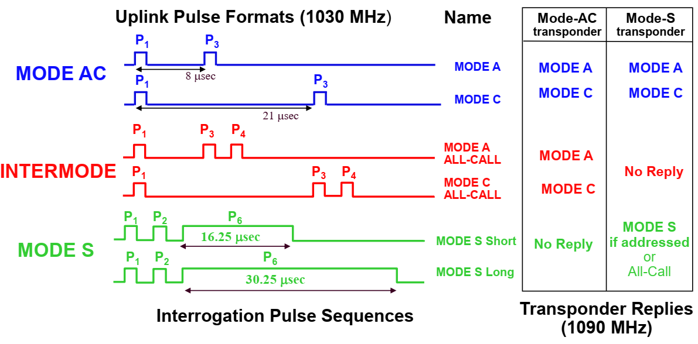
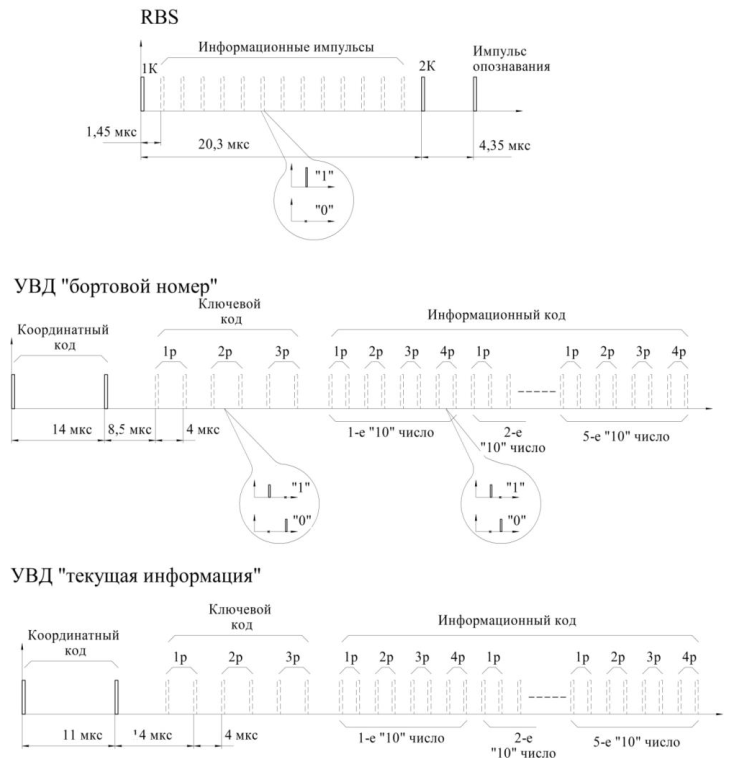
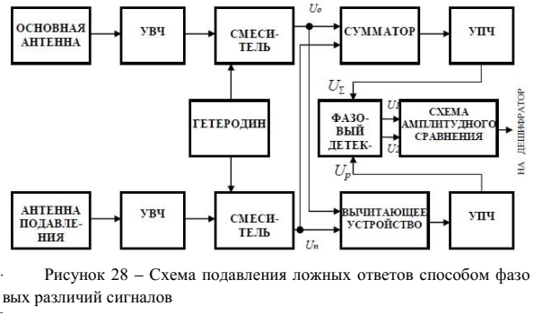

# Вторичная радиолокация

## 3.1 Основные тактико-технические требования, предъявляемые к радиолокационным станциям
- Непрерывное слежение за самолетами всех типов и размеров при любых метеорологических условиях
- Опознавание самолетов без необходимости специального маневра
- Точное определение координат самолета
- Определение относительных высот полета самолета
- Обнаружения районов с плохими метеорологическими условиями для направления самолетов в обход этих условий
- Слежение за самолетами на небольших дальностях в районах с сильными отражениями

---

## 3.2 Дальность действия систем вторичной радиолокации
Для обнаружения запросного сигнала ответчиком должно выполняться условие
$$
    Э_{пр. отв} \ge \nu N_{0.отв}
$$
$Э_{пр. отв}$ - энергия принимаемого ответчиком запросного сигнала; $\nu$ - коэффициент различимости, показывающий, насколько мощность сигнала должна превосходить мощность шума; $N_{0.отв}$ - СПМ внутренних шумов приемника
$$
    Э_{пр. отв} = \frac{Э_з \cdot G_з \cdot S_{отв}}{4\pi r_з^2}
$$
$Э_з$ - энергия излучения передатчика запросчика, $G_з$ - коэффициент усиления антенны запросчика, $S_{отв}$ - эффективная площадь приема антенны ответчика, $r_з$ - расстояние от запросчика до ответчика

Тогда дальность действия линии запроса будет
$$ \tag{3, стр. 186}
    r_{з \space max} \le \sqrt{\frac{Э_з G_з S_{отв}}{4\pi\nu N_{0 \space отв}}}
$$
$$ \tag{4, стр. 186}
    S_{отв} = \frac{\lambda^2}{4\pi}G_{отв}
$$
$$ \tag{5, стр. 186}
    r_{з \space max} \le \sqrt{\frac{Э_з G_з G_{отв} \lambda^2}{(4\pi)^2\nu N_{0 \space отв}}}
$$

Тогда дальность для линии ответа будет
$$ \tag{6, стр. 187}
    r_{отв \space max} \le \sqrt{\frac{Э_{отв} G_{отв} G_з \lambda^2}{(4\pi)^2\nu N_{0 \space з}}}
$$

Сбалансированная система - где дальность действия запроса равна дальности действия ответа. Её условие
$$ \tag{7, стр. 187}
    Э_зN_{0 \space з} = Э_{отв}N_{0 \space отв}
$$

---

## 3.3 Вторичные радиолокационные станции в системе УВД
Радиолокационный комплекс (РЛК) - совокупность первичной и вторичной РЛС.
АПОИ - аппаратура первичной обработки информации.
Вторичные РЛС по дальности действия делятся на аэродромные (100-200 км) и трассовые (до 400 км).

Кодирование во вторичных РЛС. Запросное - интервально-временное двухимпульсное кодирование (каждому значению сопоставлен определенный кодовый интервал).
Ответный код формируется методом позиционного кодирования, каждый символ передается отсутствием или наличием символа в определенный момент времени.

Для подавления сигналов по боковым лепесткам через компенсационную антенну излучается в интервале времени между импульсами излучается третий импульс. ДН компенсационной антенны в области боковых лепестков превышает по уровню основную антенну. Сравнивая амплитуды принятых импульсов, ответчик принимает решение принят ли сигнал по запросу или ответу. Это подавление БЛ по запросу. Для подавления БЛ по ответу сравниваются амплитуды в основном и компенсационном канале.

Структура сигналов земля-воздух

Структура сигналов воздух-земля

---

## 3.4 Система автоматического зависимого наблюдения

В классическом вторичном радиолокаторе подразумевалось, что станция РЛС может определить местоположение борта лучше, чем само судно. С развитием СНС и возможностью комплексирования информации в различных датчиках это стало не так. В ПНК (пилотажном Навигационном Комплексе) накапливается информация с различных датчиков и выдается на землю.

Структура ПНК

СВС - система воздушных сигналов, определяет вектор скорости.

ИНС - инерциальная навигационна система, вычисляет координаты ВС (по гироскопам и акселерометрам)

БВ - барометрический высотомер

ДИСС - допплеровский измеритель скорости и сноса, определяет скорость и угол сноса (за счет сдвига частот отраженных от поверхности земли сигналов)

РВ М/Б - радиовысотомер малых/больших высот, измеряют высоты до подстилающих поверхностей радиолокационными методами.

МРП - маркерный радиоприемник, определяет момент пролета маркерного маяка

СО - самолетный ответчик

УКВ ПРМ ПРД - приемопередатчик УКВ диапазона, служит для получения дифференциальных поправок СНС и обмена данными в системе АЗН

АРК - автоматический радиокомпас, указывает курсовой угол связных радиостанций

РСБН - радиотехническая система ближней навигации, определяет азимут по навигационному полю ближних маяков

СД - самолетный дальномер, выполняет функцию запросчика наземного ретранслятора

ГРП/КРП - глиссадный и курсовой радиоприемник, определяют отклонения от линии глиссады в двух плоскостях по сигналам радиомаячной системы посадки

СНС - спутниковая навигационная система

БЦВМ - бортовая цифровая вычислительная машина

АЗН основана на передаче достаточно точных координат судна, вычисленных на самом судне. Контрактная АЗН - передача информации только между участникам воздушного движения, заключившими соглашение на получение информации. Широковещательная АЗН - безадресная передача данных с борта воздушного судна всем заинтересованным участникам. Сами посылки разделяются во времени, т.к. участники АЗН имеют привязку к точному времени (через СНС).

---

## 3.5 Системы ближней навигации
Предназначены для привода воздушных судов в аэродромную зону и для определения горизонтальных координат воздушных судов при полете по трассе. Измерение производится при помощи бортового оборудования и наземных радиомаяков, чье положение известно. В бортовой аппаратуре измеряется азимут и наклонная дальность до точки установки наземного оборудования, по результатам этих датчиков в ПНК рассчитываются координаты самого судна.

---

## 3.6 Техническая реализация вторичного радиолокатора на примере ВРЛ "Крона"

Обобщенная структурная схема системы вторичной радиолокации

Приемник и передатчик разделены развязывающим фильтром. дальность по времени прихода. Угловая координата по пеленгации или моноимпульсным методом.

## 3.6.1 Принципы кодирования сигналов ВРЛ
В запросном канале время-импульсное кодирования. тип запроса определяется временем между импульсами.

Максимальное число кодов N определяется
$$ \tag{8, стр. 203}
    N = \frac{T_k}{\Delta t_k}
$$

В ответном сигнале - позиционное кодирование. Значение посылки определяется местами расположения импульсов кодов. Есть два варианта позиционного кодирования.

## 3.6.2 Запросные сигналы системы ВРЛ

Частоты ICAO. Запрос - 1030 МГц. Ответ - 1090 МГц.
Частоты отечественного формата. Запрос - 837,5 МГц. Ответ - 740 МГц.

## 3.6.3 Моноимпульсные ВРЛ

На самом деле про моноимпульс ничего не сказано, кроме того, что он используется.

Для решения проблемы перенасыщения канала используется дискретно-адресная систем запросов.

Импульс P2 воспринимается старым ответчиком как запрос по боковым лепесткам, и он на него не отвечает. Информация передается модуляцией фазы. Скорость передачи 4 Мбит/с. Поворот фазы осуществляется с дискретом 0,25 мкс. Первый поворот фазы - синхронизирующий. P5 затеняет опрокидывание фазы, в результате чего осуществляется защита от ответа по боковым лепесткам.

В ответе данные предаются со скоростью 1 Мбит/с, значение бита определяется его положением в интервале.

## 3.7 Принципы обработки ответных сигналов ВРЛ

Координатные импульсы в УВД в ICAO называются кадрирующими.

Для передачи высоты в международном формате используется циклический код Гилхема, который представляет из себя совокупность трехдекадного кода Грея и специального трехразрядного кода Грея.

## Первичная обработка ответных сигналов ВРЛ

### Общая схема дешифратора ответной информации

Импульсы запросных кодов P1 и P3 поступают на ДР, где формируются стробы режимов. Эти стробы позволяют селектировать определенную ответную информацию через плату сопряжения, поступая на выходное устройство.

### Принцип действия дешифратора УВД

Дешифратор сигналов УВД осуществляет декодирование координатного кода, кода "БЕДСТВИЯ", ключевого кода и информационного слова, выдаваемых ответчиком при запросе кодами ЗК1 и ЗК2.

Дешифратор декодирует одиночные и переплетенные ответные коды, образованные в результате наложения двух ответов для близко летящих ВС.

Дешифратор также исправляет одиночные и двойные ошибки. Одиночной ошибкой считается стирание или возникновение одного из символов в разряде информационного слова. Двойной ошибкой считаются следующие искажения: стирание одного и возникновение другого символа в разряде, образование двух ошибочных символов, стирание двух символов. Исправление происходит за счет того, что ответчик дважды передает информационное слово.

Ключевое слово декодируется по принципу "2 из 3" для одиночных ответов и "3 из 3" для переплетенных (в КС 3 импульса, должны совпадать 2 или 3 из них с кадрирующими)

В ДК1 (дешифратор кодов) осуществляется нормализация по амплитуде и селекция по длительности. Информационное слово поступает на ДИ (дешифратор информации). Импульс стирания запрещает прохождение информационных импульсов на выход платы ДК1.

В ДК1 задержка на 6 мкс, после чего все импульсы, предшествующие информационному, поступают на ДК2.

В ДК2 происходит дополнительная задержка на 22 мкс, которая позволяет осуществить декодирование координатного кода, кода "БЕДСТВИЕ" и ключевого слова.

В ДК3 координатная отметка задерживается на 16 мкс для совмещения с последним импульсом ключевого кода.

### Дешифратор ответных сигналов международного диапазона

В дешифраторе режимов с задерживается импульс F1 для совмещение с импульсом F2 и передается через схему И1 далее.

Перед подачей на схему задержки импульсы входной информации селектируются по длительности в пороговом устройстве ПУ и на счетных триггерах распределителя Р преобразуются в перепады напряжений. На выходе ЛЗ импульсы восстанавливаются по длительности и поступают на схему И1 и на сдвигающие регистры дешифратора информации.

Декодирование запросных кодов осуществляется по принципу совпадения импульсов Р1 и Р3 запросных кодов соответствующих режимов.

Двухканальная схема построения ДКО (Дешифратор координатных отметок) и ДИ (Дешифратор информации) канала МД позволяет декодировать ответы от двух самолетных ответчиков, информационные посылки от которых взаимно наложились друг на друга. Исключение представляет случай, когда интервал между кодовыми импульсами первой и второй посылками равен точно 1,45 мкс. В этом случае ДКО выдает только координатные отметки, а ответная информация не обрабатывается. Схема анализа в этом случае выдает сигнал "Искажение информации" и блокирует выдачу сигналов "Считывание" и "Признак".
Декодированные координатные отметки запускают девятиразрядные счетчики Сч, причем схема управления включения СУВ счетчиков обеспечивает запуск Сч1 первой КО, а Сч2 – последней КО в их возможной серии на интервале 24,65 мкс.

Счетчики с помощью импульсов кварцевого генератора КГ, период следования которых пропорционален 1,45 мкс, формируют выходную координатную отметку, а также последовательность стробирующих, сдвигающих и других вспомогательных импульсов, которые управляют работой дешифратора информации. Выходная координатная отметка (ВКО) канала МД формируется через 24,65 мкс (20,3 + 4,35 мкс) после
запуска счетчика.

Сигнал "Перепись" позволяет пересылать информацию из сдвигающегося регистра PC в регистр памяти РП ДИ. По сути ДИ преобразует последовательный код в параллельный. С выходов регистра памяти информация поступает на ДАК (дешифратор аварийных кодов), а также на преобразователь информации футы-метры.

### Фильтр несинхронных помех

Выходная декодированная координата дополнительно очищается от несинхронных помех в устройстве защиты, представляющем собой гребенчатый фильтр, настроенный на частоты, кратные частоте повторения импульсов запуска ВРЛ.

Основу фильтра составляют два регистра сдвига Рг на 35 разрядов каждый и схемы совпадения. Каждый разряд состоит из двух ячеек триггерной памяти: основной и промежуточной. С помощью тактовых импульсов входной сигнал продвигается по регистрам сдвига, причем время задержки в каждом регистре определяется генератором тактовых импульсов ГТИ, который запускается импульсом генератора запуска ГЗ, совпадающим с началом отсчета дальности, а останавливается импульсом счетчика Сч, соответствующим концу периода следования запросных импульсов ВРЛ. При логике обработки "2 из 2" задержанный сигнал подается на схему совпадения И с Рг1.

При логике обработки "2 из 3" задержанный на два периода повторения сигнал снимается с выхода регистра Рг2. Сигнал "УПРАВЛЕНИЕ ОЧИСТКОЙ" позволяет блокировать фильтр.

## 3.8 Защита системы ВРЛ от ложных запросов и ложных ответов

## Улучшенный метод защиты от боковых лепестков по запросу

Если уровень сигнала от бокового лепестка был недостаточен для
фиксации прихода первого импульса (Р1), то приход импульса Р2 через
диаграмму подавления блокирования ответчика не вызывает, и он ответит на отраженный запрос.
В последнем случае система подавления по запросу не может
предотвратить ответ. Для улучшения эффекта блокирования по боковому лепестку и улучшения подавления отражений от главного лепестка
применяется режим улучшенного подавления, показанный на
рисунке 24 б).

## Амплитудный метод подавления боковых лепестков по ответу
Прием осуществляется по основному каналу $U_1$ и каналу подавления $U_2$. После приема вычисляется разность $U_3 = U_1 - U_2$ . Если $U_3 > 0$, то сигнал принят по основному направлению, если $U_3 < 0$, то по боковому лепестку.

Для того, чтобы вычисление разности не приводило к ухудшению ОСШ, диаграмма канала подавления должна иметь минимум в направлении основного лепестка.

## Амплитудно-фазовый метод защиты ВРЛ от ложных ответов

В такой системе в качестве критерия принадлежности сигнала, принятого основным или боковыми лепестками ДНА, используется соотношение амплитуд этих сигналов. Однако, для исключения влияния различий коэффициентов передачи приемных трактов (основного и подавления) это соотношение амплитуд преобразуется в фазовые соотношения.

Принцип работы заключается в следующем. Сигналы, принятые основной антенной и антенной подавления, одновременно складываются и вычитаются. Образующиеся суммарный и разностный сигналы получают относительно друг друга определенные фазовые различия, которые в зависимости от направления приема будут иметь одно из двух возможных значений:
- при приеме с направления главного лепестка основной антенны угол между векторами суммарного и разностного сигналов будет острым (< 90°);
- при приеме сигналов с направления боковых лепестков угол между векторами суммарного и разностного сигналов будет тупым (> 90 °).

При приеме с направления боковых лепестков сигнал, поступающий от основной антенны, будет всегда меньше сигналов, поступающих от антенны подавления. В этом случае (рисунок 27 б)) угол между векторами суммарного UΣ и разностного Up сигналов будет тупым: 90° < φбл < 180°.

Суммарные и разностные сигналы, получившие фазовые различия в зависимости от направления приема, усиливаются в отдельных каналах промежуточной частоты, после чего фазовые соотношения вновь преобразуются в амплитудные. Суммарные и разностные сигналы сравниваются по фазе с помощью фазового детектора. При этом суммарные сигналы промежуточной частоты используются в качестве опорных и подаются на оба плеча детектора в фазе.

