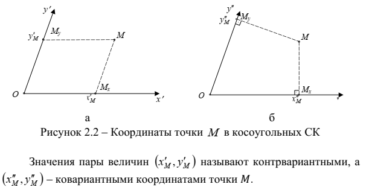
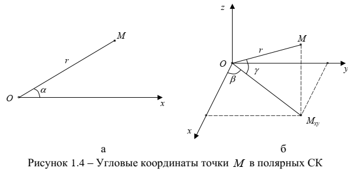

# 1 Геометрическая теория радионавигации

Радионавигация – радиотехнические методы и средства местоопределения и навигации подвижных объектов, основаны на обработке объектами навигации сигналов, излучаемых специальными радионавигационными точками.

## 1.1 Семантические аспекты

## 1.2 основные понятия и определения координатометрии объектов

Траектория движения - кривая в пространстве, по которой движется центр масс объекта.

Система местоопределения (МО) - совокупность средств измерений и обработки, позволяющих вычислить координаты объекта.

Местоположение объекта - совокупность характеристик, описывающих его расположение в некотором пространстве относительно фиксированных объектов.

Координаты объекта - количественные характеристики местоположения объекта, упорядоченный набор линейных и/или угловых величин, определяющих положение объекта.

Координаты можно определить длинами отрезков между началом СК и проекциями точки расположения объекта на соответствующей оси. При этом проекции могут быть параллельными или ортогональными осям СК.

Пеленг - направление от наблюдателя на какой-либо объект, характеризуется угловыми величинами.

Линия пеленга/визирования - прямая, проходящая через точку наблюдения и объект.

---

Система координат на стр. 10

---

Углы в сферической системе координат

$\beta$ - азимут, $\gamma$ - угол места

---

Задача местоопределения (самоопределения) объекта (МО) - имеется некоторый объект с неизвестными координатами и набор фиксированных точек. Требуется определить координаты объекта путем обработки результатов наблюдений объекта за этими фиксированными точками

Задача определения местоположения (иноопределения) объекта (ОМП) - имеется некоторый объект с неизвестными координатами и набор фиксированных точек. Требуется определить координаты объекта путем обработки результатов наблюдений за объектом из этих фиксированных точек

Параметры местоположения - параметры, позволяющие охарактеризовать положения объекта в трехмерном пространстве

Поверхность положения - множество точек пространства, для которых значение параметра местоположения постоянно

Координатометрическая задача - алгоритм обработки параметров местоположения для получения координат объекта
