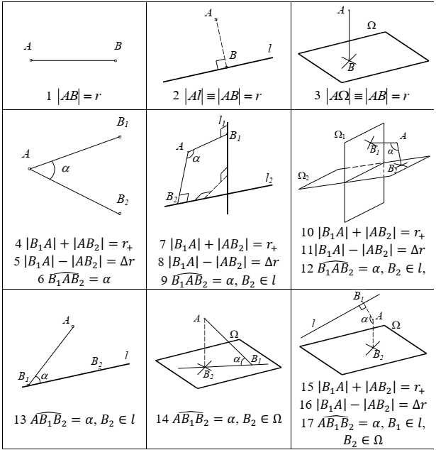
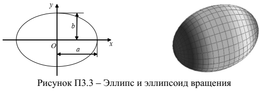
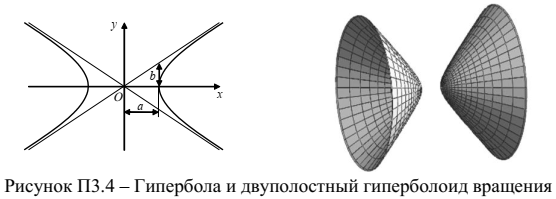
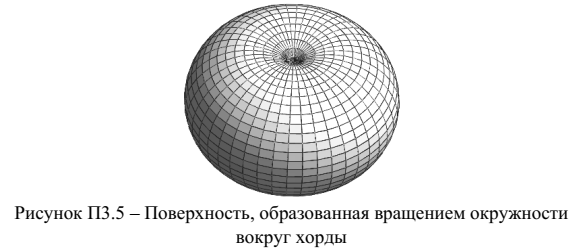
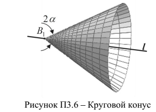
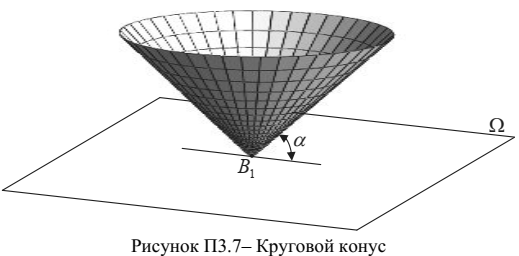
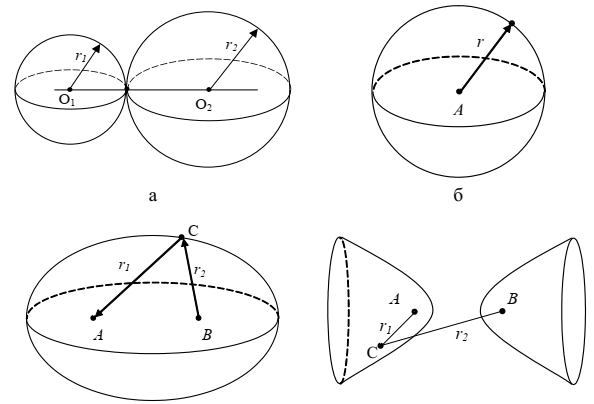
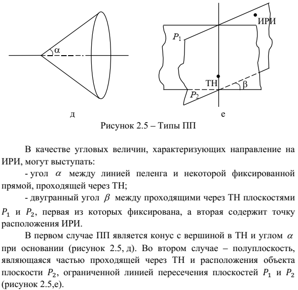

# 1.3 Геометрическая сущность местоположения объекта

В радионавигации речь идет о точечном объекте, чье положение определяется относительно элементарных геометрических объектов (ЭГО) - точки, прямой и пространства.

---

Отношения 1 - 3

Положение точки $A$ относительно фиксированной точки $B$ может быть охарактеризовано дальностью $r=|AB|$.

Линией положения точки $А$ на плоскости является окружность радиуса $r$ с центром в точке $B$. Поверхностью положения точки $A$ в пространстве является сфера радиуса $r$ с центром в точке $B$.

Положение точки $A$ относительно фиксированной прямой $l$ или плоскости $\Omega$ также может быть охарактеризовано дальностью $r$. При этом расстояние между точкой $A$ и прямой $l$ (плоскостью $\Omega$) есть расстояние между точкой $A$ и точкой $B$, являющейся ее проекцией на эту прямую (плоскость).

Для условия прямой $l$ линией положения точки $A$ на плоскости является пара параллельных прямых, расположенных на расстоянии $r$ от прямой $l$ и на расстоянии $2r$ друг от друга. Поверхностью положения точки $A$ является цилиндр радиуса $r$, осью симметрии которого является прямая $l$.

Для условия плоскости $\Omega$ поверхностью положения точки $A$ является пара параллельных плоскостей, расположенных на расстоянии $r$ от плоскости $\Omega$ и на расстоянии $2r$ друг от друга.

---

Отношения 4 - 6

Относительно двух фиксированных точек $B_1$ и $B_1$ положение точки $A$ может быть охарактеризовано тремя геометрическими параметрами:
- суммой дальностей (суммарной дальностью) $r_+ = |𝐵_1 𝐴| + |𝐴 𝐵_2|$;
- разностью дальностей $\Delta r = |𝐵_1 𝐴| − |𝐵_2 𝐴|$;
- углом $\alpha = 𝐵_1 \hat{A} 𝐵_2$ между линиями визирования точек $B_1$ и $B_2$.

При задании местоположения точки $A$ значением суммарной дальности $r_+$ поверхность ее положения представляет эллипсоид вращения, фокусы которого совпадают с точками $B_1$ и $B_2$

При задании местоположения точки $A$ значением разности дальностей $\Delta r$ поверхность ее положения представляет двуполостный гиперболоид вращения, фокусы которого совпадают с точками $B_1$ и $B_2$

При задании местоположения точки $A$ значением угла $\alpha$ между линиями визирования точек $B_1$ и $B_2$ поверхность ее положения представляет внешнюю поверхность геометрической фигуры, образованной вращением окружности с радиусом $r=|B_1 B_2|/(2\sin{\alpha})$ вокруг хорды $[B_1 B_2]$.

---

Отношения 7 - 9

Положение точки $A$ относительно двух фиксированных прямых $l_1$ и $l_2$ может быть охарактеризовано также тремя геометрическими параметрами:
- суммой дальностей $r_+ = |𝐵_1 𝐴| + |𝐴 𝐵_2|$;
- разностью дальностей $\Delta r = |𝐵_1 𝐴| − |𝐵_2 𝐴|$;
- углом $\alpha = 𝐵_1 \hat{A} 𝐵_2$ между линиями визирования точек $B_1$ и $B_2$.

Точки $B_1$ и $B_2$ есть проекции точки $A$ на прямые.

При задании местоположения точки $A$ значением суммарной дальности $r_+$ поверхность ее положения представляет множество точек пресечения круговых цилиндров радиусами $r_1$ и $r_2$, имеющих осями центральной симметрии прямые $l_1$ и $l_2$, соответственно. Причем $r_1, r_2  \in [0, r_+]$

При задании местоположения точки $A$ значением разности дальностей $r_-$ поверхность ее положения представляет множество точек пресечения круговых цилиндров радиусами $r_1$ и $r_2$, имеющих осями центральной симметрии прямые $l_1$ и $l_2$, соответственно. Причем $r_1 - r_2 = \Delta r$

При задании местоположения точки $A$ значением угла $\alpha$ между линиями визирования точек $B_1$ и B_2, являющихся проекциями точки $A$ на прямые $l_1$ и $l_2$ соответственно, местоположение точки $A$ локализуется как минимум двумя точками, симметричными относительно кратчайшего отрезка между $l_1$ и $l_2$. На плоскости значение угла $\alpha$ равно значению угла между опорными прямыми и локализует положение точки $A$ принадлежностью одной из двух частей плоскости, ограниченных $l_1$ и $l_2$ (при $l_2 || l_2$ и $\alpha \in [0, \pi]$).

---

Отношение 12

При задании местоположения точки $A$ значением угла $\alpha$ между линиями визирования точек $B_1$ и $B_2$, являющихся проекциями точки $A$ на плоскости $\Omega_1$ и $\Omega_2$ соответственно, местоположение точки $A$ локализуется принадлежностью одной из двух частей пространства, ограниченных $\Omega_1$ и $\Omega_2$ (при $\Omega_1 || \Omega_2$ и $\alpha \in [0, \pi]$)

---

Отношение 13

При задании местоположения точки $A$ отношением 13 поверхностью положения точки $A$ является круговой конус

---

Отношение 14

При задании местоположения точки $A$ отношением 14 поверхностью положения точки $A$ также является круговой конус, но с другими параметрами

---

Отношения 15 - 17

Положение точки $A$ относительно фиксированной прямой $l$ и плоскости $\Omega$ может быть охарактеризовано тремя геометрическими параметрами:
- суммой дальностей $r_+ = |𝐵_1 𝐴| + |𝐴 𝐵_2|$;
- разностью дальностей $\Delta r = |𝐵_1 𝐴| − |𝐵_2 𝐴|$;
- углом $\alpha = \angle 𝐵_1 A 𝐵_2$, $B_1\in l$, $B_2\in \Omega$  между линиями визирования точек $B_1$ и $B_2$, где $B_1$ и $B_2$ проекция точки $A$ на прямую и плоскость.

При задании местоположения точки $A$ значением суммарной дальности $r_+$ поверхность ее положения представляет множество точек пресечения круговых цилиндров радиусами $r_1$, имеющих осями центральной симметрии прямую $l$ и плоскость $\Omega$. Причем $r_1, r_2  \in [0, r_+]$, где $r_2 \equiv |\Omega|$

При задании местоположения точки $A$ значением разности дальностей $\Delta r$ поверхность ее положения представляет множество точек пресечения круговых цилиндров радиусами $r_1$, имеющих осями центральной симметрии прямую $l$ и плоскость $\Omega$, соответственно. Причем $r_1 - r_2 = \Delta r$, где $r_2 \equiv |\Omega|$

При задании местоположения точки $A$ значением угла $\alpha$ между линиями визирования точек $B_1$ и $B_2$, являющихся проекциями точки $A$ на прямую $l$ и плоскость $\Omega$, местоположение точки $A$ определяется принадлежностью плоскости, содержащей точку $A$ и прямую $l$.

---

Геометрические параметры местоположения - геометрические образцы, позволяющие характеризовать положение объекта в пространстве относительно фиксированных точек, прямых и плоскостей. Это дальность, разность дальностей, сумма дальностей и угол.

Геометрические параметры местоположения не изменяются при переходе в другую СК.

Геометрический фактор - взаимное положение элементов координатометрической системы и позиционируемого объекта.

Задачей координатометрической системы является определение необходимого числа значений геометрических параметров местоположения и вычисление координат объекта в заданной СК.

Задание единственного значения геометрического параметра местоположения объекта уменьшает неопределенность его пространственного положения до принадлежности ПП.

Задание пары независимых значений параметров местоположения объекта уменьшает неоднозначность его пространственного положения до принадлежности пространственной кривой, являющейся пересечением двух ПП. В частных случаях эта кривая может вырождаться в точку.

Задание трех независимых значений параметров местоположения объекта уменьшает неоднозначность его пространственного положения до принадлежности одной из пары точек (в частных случаях точке или пространственной кривой), являющихся пересечением трех ПП.

Практически во всех случаях (за исключением расположения всех ОТ на одной прямой) четыре независимых значения геометрических параметров местоположения объекта полностью устраняют неоднозначность его пространственного местоположения и позволяют вычислить координаты объекта как координаты единственной точки пересечения четырех ПП.

---

Примеры геометрических параметров в навигации

Две дальности, дальность, суммарная дальность, разностная дальность:

Углы:

