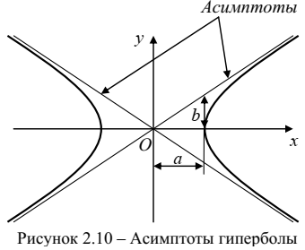

# 2.1 Взаимосвязь параметров местоположения с параметрами излучения объекта
В однородной среде ЭМВ распространяются прямолинейно с постоянной скоростью
$$
    c = \frac{1}{\varepsilon_a\mu_a}
$$
где $\varepsilon_a$, $\mu_a$ - абсолютная диэлектрическая и магнитная проницаемость среды.

---

## Измерение дальность по одной ОТ
$$
    P_п=P_0\cdot k_1(r)\text{, }k_1(r)=\frac{1}{4\pi r^2} \\
    r=\sqrt{\frac{P_0}{4\pi P_п}}Ф
$$
$Ф$ - коэффициент пропорциональности, учитывающий форму диаграммы направленности передающей антенны и свойства среды распространения
$$
    t_п=t_0+k_2(r), k_2(r)=\frac{r}{c}
$$
$$
    r=c(t_п-t_0)
$$

## Измерение дальности по двум ОТ
Однако $P_0$ $t_0$ могут быть неизвестны, тогда.
$$
    \begin{cases}
        P_{п1}=P_0\cdot k_1(r_1), \\
        P_{п2}=P_0\cdot k_1(r_2),
    \end{cases}
$$
Можно составить пропорцию
$$
    \frac{P_{п1}}{P_{п2}} = \frac{k_1(r_1)}{k_1(r_2)}
$$
Задав систему координат, чтобы дальности были
$$
    r_1 = \sqrt{x_u^2+y_u^2+z_u^2} \text{; } r_2 = \sqrt{(x_u-R)^2 + y_u^2 + z_u^2}
$$
$R$ - расстояние между ОТ. выразив систему уравнений через отношение
$$
\frac{P_{п1}}{P_{п1}} = \frac{(x_u - R)^2 + y_u^2 + z_u^2}{x_u^2+y_u^2+z_u^2}
$$
Из этого выражения можно вывести
$$
    \left(x_u + \frac{RP_{п2}}{P_{п1} - P_{п2}}\right)^2 + y_u^2 + z_u^2 = \frac{R^2P_{п1}P_{п2}}{(P_{п1} - P_{п1})^2}
$$
что соответствует уравнению сферы. Т.е. при наличии информации о плотности потока мощности сигнала в 2-х точках, априорная неопределенность снижается до ПП в иде сферы.

При измерении времени прихода
$$
    \begin{cases}
        t_{п1}=t_0\cdot k_2(r_1), \\
        t_{п2}=t_0\cdot k_2(r_2),
    \end{cases}
$$
Можно составить уравнение
$$
    t_{п1} - t_{п2} = k_2(r_1) - k_2(r_2) = \frac{r_1 - r_2}{c}
$$
Задав систему координат, чтобы дальности были
$$
    r_1 = \sqrt{(x_u+a)^2+y_u^2+z_u^2} \text{; } r_2 = \sqrt{(x_u-a)^2 + y_u^2 + z_u^2}
$$
Получаем
$$
    \Delta r^2 = 2\left(a^2 + x_u^2 + y_u^2 + z_u^2 - \sqrt{(a+x_u)^2+y_u^2+z_u^2}\cdot\sqrt{(a-x_u)^2+y_u^2+z_u^2}\right)
$$
Преобразуя, получаем уравнение двуполостного гиперболоида вращения
$$
    \frac{x_u^2}{a_1^2} - \frac{y_u^2}{b_1^2} - \frac{z_u^2}{b_1^2} = 1
$$
где $a_1 = \Delta r/2$, $b_1 = \sqrt{4a^2 - \Delta r^2}/2$

---

## Свойства двуполостного гиперболоида

1. У гиперболоида есть 2 асимптоты - прямые линии, кратчайшее расстояние от которых до гиперболы при неограниченном удалении от начала СК стремится к 0. Для двухполосного гиперболоида вращения существует асимптотический конус. Если расстояние между фокусами много меньше расстояния от фокусов до лоцируемого объекта, до допустимо считать, что ПП есть асимптотический конус.
2. Гиперболоид вырождается в плоскость при $\Delta r = 0$
3. Гиперболоид вырождается в полупрямую при $\Delta r_{12} = d$, где $d$ - расстояние между фокусами

