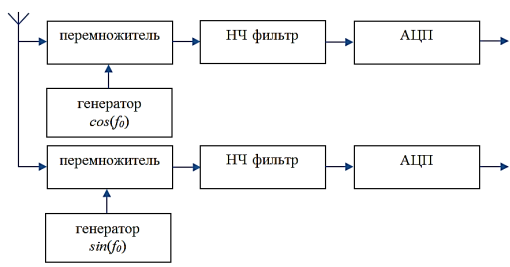

# 3 Технология РН определений

Каждый миллисекундный интервал излучаемого сигнала состоит из 1023 одинаковых подинтервалов, на части из которых сигнал, представляющий собой синусоиду, инвертирован.Данный вариант сигналообразования является разновидностью фазовой манипуляции.

Для каждого НКА используется уникальная модулирующая (манипулирующая) последовательность длиной 1023 бита, в качестве которой применяется псевдослучайная последовательность (ПСП) Голда.

Навигационный сигнал излучается непрерывно, при этом начало каждой миллисекундной посылки привязано к бортовой шкале времени НКА, а сама посылка может передаваться в прямой или инверсной форме, что позволяет с помощью навигационного сигнала передавать пользователю исходные данные, необходимые для выполнения расчетов координат. Значение одного информативного бита передается в течение 20 мс (т.е. информационный бит представлен двадцатикратным повторением одинаковых миллисекундных посылок).

При приеме сигнал сдвигается на частоту доплера. Принятый сигнал умножается на частоту гетеродина (проводится квадратурная демодуляция)

Ширина спектра определяется шириной ПСП (5 или 10 МГц).

На вход поступает сигнал
$$
    u(t) = U\cos(2\pi(f_0 + f_d)t + \varphi_{псп}(t) + \varphi_0)
$$

После квадратурной демодуляции
$$
    i_S(t) = A\cos(2\pi f_dt + \varphi_{псп}(t) + \varphi_0) \\
    q_S(t) = A\cos(2\pi f_dt + \varphi_{псп}(t) + \varphi_0)
$$

Затем для поиска сигнала вычисляется корреляционная функция. Каждый спутник излучает свою ПСП. Для вычисления ВКФ строится модуль принимаемого сигнала, в данной модели неизвестны $f_d$, $\varphi_{псп}$ (текущей) и $\varphi_0$.
$$
    i_M(t) = A\cos(2\pi f_1t + \varphi_{псп}(t_i) + \varphi_{01}) \\
    q_M(t) = A\cos(2\pi f_1t + \varphi_{псп}(t_i) + \varphi_{01})
$$

Максимум КФ имеет место при выполнении условия, что модель точно похожа на сигнал. Если подобрать параметры модели, обеспечивающие максимум значения КФ, то значения параметров модели могут быть приняты в качестве оценок параметров принятого сигнала.

Если в результате сравнения фрагмента потока со сформированной моделью выявлена высокая схожесть (значение КФ превышает значение выбранного порога), то фиксируется текущее значение позиции потока, при котором результат сравнения дал максимальный отклик.

Высокое значение КФ свидетельствует об обнаружении в потоке стандартной для конкретного НКА миллисекундной посылки. С учетом непрерывности излучаемого НКА сигнала, состоящего из последовательности одинаковых миллисекундных фрагментов, следующий пик КФ должен иметь место через 1 мс.

Вследствие использования для информационной модуляции сигнала НКА инверсии миллисекундных посылок, в КФ наблюдаются пропуски всплесков. Средняя периодичность такого события имеет величину 40 мс.

Из-за изменения расстояния между НКА и потребителем, периодически идет подстройка фазы модели и частоты.

Т.о. процесс поиска сигналов НКА состоит в том, что принимается все, что пришло на вход приемника на частоте 1575,42 МГц, формируется модель сигнала, который может быть на входе приемника, и сравнивается принятое с моделью. Если проявляется схожесть (max(КФ) > порогового значения), то принимается решение о наличии сигнала.

Для НКА, сигналы которых обнаружены, необходимо организовать слежение с подстройкой и получить информативные биты, несущие информацию о НКА и времени. После первого обнаружения можно предсказать положения остальных НКА.
