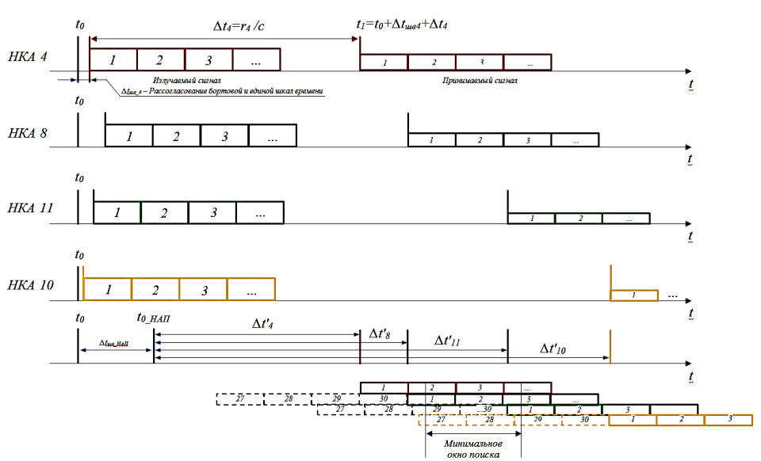

# 4 Вторичная обработка

Каждую группу из 20 одинаковых канальных потоковых символов необходимо преобразовать в потоковые информационные символы. Поскольку начало приема сигнала не синхронизировано с началом информационного символа, то необходимо выделить границу групп канальных потоковых символов.

Информация в навигационном сигнале передается кадрами, состоящими из слов. Каждое слово – 30 двоичных символов: 24 информативных и 6 проверочных.

Поскольку в момент начала приема сигнала имеется неопределенность начальной фазы, то взятые из канала биты – это условные нули и единицы, то есть с вероятностью 0,5 их необходимо инвертировать.

Строится 6 проверочных уравнений. Если шесть проверочных уравнений сошлись, то 𝑑1 – вероятное начало слова (вероятное, поскольку может иметь место и случайное совпадение). Если через каждые следующие 30 символов проверочные уравнения опять сходятся, то значит синхронизация по словам выполнена.

Далее ищется слово, начинающееся с комбинации 10001011 (преамбула). Если в каждом кратном слове началом является преамбула, то это первое слово каждого кадра и кадровая синхронизация выполнена.

Кадры следуют группами. Кадры 1-3 всегда имеют одинаковую структуру, структура кадров 4 и 5 зависит от номера страницы. Суперкадр состоит из 25 страниц.

Из-за разных значений расстояний от приемника до НКА навигационные сигналы принимаются не одновременно. Поскольку начало преамбулы привязано к бортовой шкале времени (с учетом передаваемых поправок), то разности времен приема с точностью до миллисекунды можно определить по моменту приема начала преамбулы.

Т.к. точность шкалы времени НАП сильно хуже точности точности в НКА, классический дальномерный метод не может быть использован для определения местоположения. Используется псевдодальномерный метод, за счет добавления четвертого уравнения.

Классическое уравнения имеет вид
$$
    \begin{cases}
        r_1^2 = (x - x_1)^2 + (y - y_1)^2 + (z - z_1)^2\\
        r_2^2 = (x - x_2)^2 + (y - y_2)^2 + (z - z_2)^2\\
        r_3^2 = (x - x_3)^2 + (y - y_3)^2 + (z - z_3)^2\\
        r_4^2 = (x - x_4)^2 + (y - y_4)^2 + (z - z_4)^2
    \end{cases}
$$

В терминах радиофизики
$$
    \begin{cases}
        (c\cdot(t - t_1))^2 = (x - x_1)^2 + (y - y_1)^2 + (z - z_1)^2\\
        (c\cdot(t - t_2))^2 = (x - x_2)^2 + (y - y_2)^2 + (z - z_2)^2\\
        (c\cdot(t - t_3))^2 = (x - x_3)^2 + (y - y_3)^2 + (z - z_3)^2\\
        (c\cdot(t - t_4))^2 = (x - x_4)^2 + (y - y_4)^2 + (z - z_4)^2
    \end{cases}
$$

С учетом несогласованности шкал
$$
    \begin{cases}
        (c\cdot(t_1 - t_{0\_НАП} + \Delta t_{ШВ\_НАП}))^2 = (x - x_1)^2 + (y - y_1)^2 + (z - z_1)^2\\
        (c\cdot(t_2 - t_{0\_НАП} + \Delta t_{ШВ\_НАП}))^2 = (x - x_2)^2 + (y - y_2)^2 + (z - z_2)^2\\
        (c\cdot(t_3 - t_{0\_НАП} + \Delta t_{ШВ\_НАП}))^2 = (x - x_3)^2 + (y - y_3)^2 + (z - z_3)^2\\
        (c\cdot(t_4 - t_{0\_НАП} + \Delta t_{ШВ\_НАП}))^2 = (x - x_4)^2 + (y - y_4)^2 + (z - z_4)^2
    \end{cases}
$$
где $c\cdot(t_i - t_{0\_НАП})$ - оценка дальности (псевдодальности до НКА), $c\cdot\Delta t_{ШВ\_НАП}$ - ошибка, обусловленная рассогласованием шкалы времени.

Метод можно интерпретировать как разностно-дальномерный.

## Особенности решения навигационной задачи

Особенностью решения навигационной задачи на практике является априорная неопределенность изменений значения скорости распространения навигационного радиосигнала на трассе НКАпотребитель. Радиотрассу можно разделить на три участка: космос, ионосфера, тропосфера. На каждом участке значение скорости
известно, но длины участков априорно не известны.

Вторая особенность состоит в том, что за счет вращения Земли
потребитель изменяет свое местоположение относительно НКА за
время распространения сигнала на величину, зависящую от широты
потребителя и протяженности радиотрассы НКА-потребитель. При
этом для каждого НКА фактор дальности различен.

Следовательно, навигационную задачу придется решать
неоднократно: на первом этапе рассчитать грубую оценку координат
пользователя, исходя из взаимного положения НКА и пользователя
определить длины участков радиотрасс и при повторном решении
учесть указанные выше особенности.

Система уравнений линеаризуется, а затем итеративно решается. На каждой итерации точность повышается.

Линеаризованная система имеет вид
$$
    \begin{cases}
        \frac{x_1 - x_0}{p_1 - t_0}dx_0 + \frac{y_1 - y_0}{p_1 - t_0}dy_0 + \frac{z_1 - z_0}{p_1 - t_0}dz_0 + dt_0 = dp_1 \\
        \frac{x_2 - x_0}{p_2 - t_0}dx_0 + \frac{y_2 - y_0}{p_2 - t_0}dy_0 + \frac{z_2 - z_0}{p_2 - t_0}dz_0 + dt_0 = dp_2 \\
        \frac{x_3 - x_0}{p_3 - t_0}dx_0 + \frac{y_3 - y_0}{p_3 - t_0}dy_0 + \frac{z_3 - z_0}{p_3 - t_0}dz_0 + dt_0 = dp_3 \\
        \frac{x_4 - x_0}{p_4 - t_0}dx_0 + \frac{y_4 - y_0}{p_4 - t_0}dy_0 + \frac{z_4 - z_0}{p_4 - t_0}dz_0 + dt_0 = dp_4
    \end{cases}
$$
Заданы значения псевдодальностей $p_i$ и координат НКА $\{x_i, y_i, z_i\}$.

1. Для первой итерации принимаем $x_0, y_0, z_0, t_0 = 0$. Вычисляем значения $dp_i$ как разницу дальности между заданным положением объекта и НКА. Подставляем их в систему уравнений и вычисляем $dx_0$, $dy_0$ и $dz_0$ и $dt_0$.
2. Вычисляем новые значения $x_0/y_0/z_0/t_0 = x_0/y_0/z_0/t_0 + dx_0/dy_0/dz_0/dt_0$. Подставляем значения в систему уравнений и вычисляем с п. 1 заново.
3. Повторяем пока $\sqrt{dx_0^2 + dy_0^2 + dz_0^2 + dt_0^2}$ не станут меньше заранее заданного значения.
