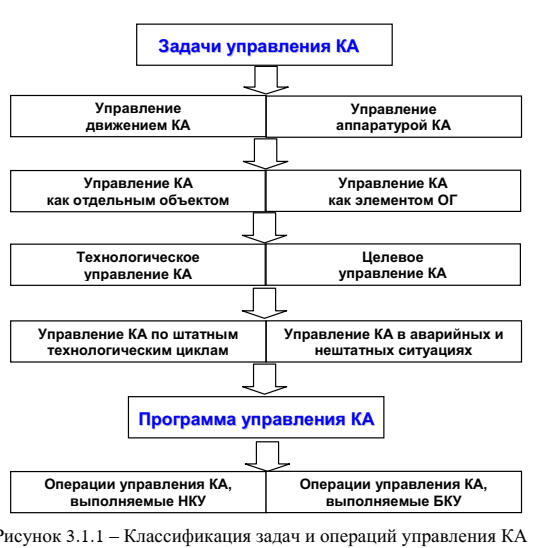

# 5 Автономное навигационно-баллистической обеспечение управления КА при решении ими задач по предназначению

## 5.1 Общая характеристика задач управления КА и автоматизированных систем управления КА

---

Система контроля управления КА

Под технологией управления КА в общем случае следует понимать структуру АСУ КА, совокупность процессов функционирования и взаимодействия ее элементов и методы технической реализации операций управления КА.

---

Схема функционирования АСУ КА

Можно выделить три уровня АСУ КА.
- Первый уровень – уровень Центра управления полетом (ЦУП) КА, на котором осуществляется взаимодействие со специальным комплексом (СпК), в интересах которого функционируют КА определенного типа, принимаются все решения по управлению КА и порядку их реализации средствами НКУ и БКУ в процессе ТЦУ КА.
- Второй уровень – уровень командно-измерительных пунктов КИП, на котором с помощью РЭС осуществляется радиоуправление КА в ходе проведения сеансов управления. Особенностью этого уровня является то, что на нем информационного взаимодействие средств различных АСУ КА тесно переплетается, поскольку одни и те же РЭС в соответствии с планом применения средств НАКУ в различные моменты времени могут использоваться для управления различными типами КА.
- Третий уровень – уровень БКУ КА, на котором в рамках принятого распределения функций между НКУ и БКУ осуществляется автономное управление КА. Особенностью этого уровня является его локализация на КА.

Уровень автономности – доля операций управления КА, выполняемых БКУ в режиме автономного управления.

---

## 5.2 Технологические циклы управления КА

ТЦУ представляет собой повторяющуюся совокупность операций управления КА на определенном интервале времени.

Программу полета КА на всем его протяжении принято представлять в виде последовательности типовых суток полета. В каждые типовые сутки реализуется свой типовой (для штатного функционирования КА и средств НКУ) ТЦУ КА.

ТЦУ КА реализуются в контуре управления КА. В структуре АСУ КА реализуются «большой» и «малый» контуры управления КА.

В "большом" контуре в качестве объекта управления выступает КА в целом и его бортовые системы (основные и обеспечивающие), субъектом управления является ЦУП КА. Контур управления образуется прямым каналом от ЦУП к КА и обратным каналом от КА к ЦУП. Информационное взаимодействие средств НКУ с КА происходит через БКУ КА.

Структура малого контура

В качестве объекта управления выступают бортовые системы КА, субъектом управления является БКУ. Контур управления образуется прямым каналом от БКУ к бортовым системам КА и обратным каналом от бортовых систем КА к БКУ. По прямому каналу контура управления бортовые средства КПО передают на бортовые системы КА управляющие воздействия, принятые от НКУ и сформированные в БКУ. По обратному каналу контура управления бортовые средства НБО и ИТО передают в БКУ результаты автономных измерений ТНП КА и автономного контроля параметров бортовых систем КА.

Распределение задач КПО между НКУ и БКУ
- НКУ осуществляет планирование всех режимов функционирования и операций управления КА при выполнении программы полета (ТЦУ, отдельных сеансов управления) и радиоуправление КА в ходе сеансов управления – командно-программное путем передачи КПИ и через полетное задание путем обновления программного обеспечения БКУ (входящих в его состав БЦВМ);
- БКУ выполняет записанные в его программном обеспечении жесткие программы управления, формирует отдельные команды управления бортовой аппаратурой КА в штатном режиме функционирования и осуществляет автономное управление бортовой аппаратурой КА в режиме автономного функционирования

Задачи НБО распределяются между НКУ и БКУ следующим образом:
- НКУ осуществляет наземные измерения ТНП КА, прогноз параметров орбиты и расчет маневров КА (коррекции орбиты или перехода на другую орбиту), а также расчет для средств НАКУ исходных данных и целеуказаний, необходимых для проведения сеансов управления КА;
- БКУ осуществляет бортовые измерения ИТНП, управление движением и автономную навигацию КА.

Задачи ИТО распределяются между НКУ и БКУ следующим образом:
- НКУ осуществляет прием ТМИ с КА, обработку всего объема ТМИ и оценку технического состояния бортовой аппаратуры, исходя из которой планируется последующее применение КА;
- БКУ осуществляет контроль основных параметров бортовой аппаратуры КА, автономную обработку данных телеметрического контроля и оценку технического состояния КА

---

## 5.3 Навигационно-баллистическое обеспечение управления НКА

Основными задачами НБО являются:
- измерение ТНП КА;
- определение и прогнозирование параметров орбиты КА по результатам обработки измерений;
- расчет исходных данных для выполнения коррекции орбиты с целью поддержания заданных параметров или маневров КА с целью перехода с одной орбиты на другую;
- расчет баллистических данных, необходимых для работы средств НКУ и пунктов приема информации с КА (интервалов радиовидимости КА наземными средствами, целеуказаний для наведения антенных систем и других).

## 5.4 Бортовые комплексы управления КА

Формирование программ управления при автономном управлении осуществляется в соответствии с одним из двух принципов: программного управления или терминального управления.

При программном управлении программа управления формируется до начала процесса управления, а в процессе управления осуществляется только её отработка.

При терминальном управлении программа управления формируется непосредственно в процессе управления с использованием текущей информации о состоянии объекта управления, внешних условиях и о степени достижения цели управления.

Основными операциями управления КА, выполняемыми БКУ в автономном режиме, являются:
- Управление ориентацией и стабилизацией КА
- Включение, изменение режимов работы и отключение аппаратуры бортовых систем по командам и программам управления
- При возникновении отказов бортовой аппаратуры по результатам диагностирования ее состояния переключение основных и резервных комплектов бортовых систем для восстановления работоспособности КА

- НКУ - наземный комплекс управления
- СБИ - система бортовых измерений
- САН - система автономной навигации
- БСЧВ - бортовой стандарт частоты и времени
- БЦВМ - бортовая цифровая вычислительная машина
- БА КИС - бортовая аппаратура командно-измерительной системы
- БПУ - бортовое программное устройство
- СТК - система трансляции команд
- СУДН - система управления движением и навигацией
- СУБА - система управления бортовой аппаратурой

БПУ, САН и БСЧВ могут объединяться в бортовое синхронизирующее координатно-временное устройство.

Основной функцией СТК является дешифровка команд управления и их распределение между исполнительными органами.

## 5.6 Направления совершенствования навигационно-баллистического обеспечения управления КА и бортовых систем автономной навигации

Для повышения точности автономной навигации как в оперативном, так и в апостериорном режимах необходимы дополнительные навигационные данные. Такими данными являются данные систем функциональных дополнений (ФД) глобальных спутниковых радионавигационных систем. В общем случае под ФД спутниковых радионавигационных систем понимаются не входящие в их состав аппаратные и программные средства, предназначенные для повышения точности навигационных определений потребителей на основе навигационного сигнала спутниковых радионавигационных систем.

Основным ФД на текущий момент является система прецизионной навигации (СПН).
